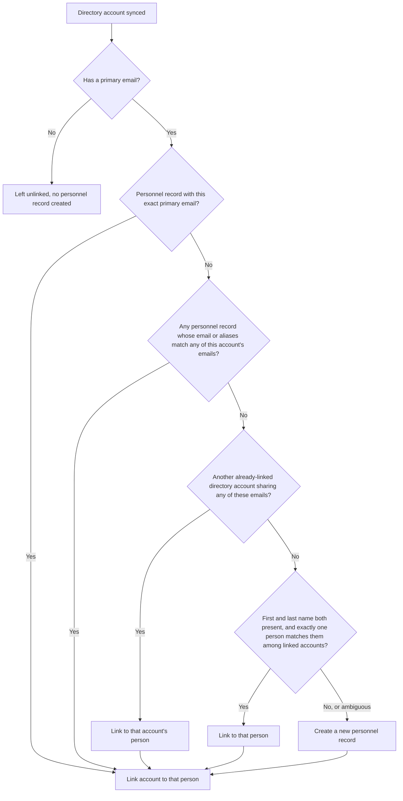
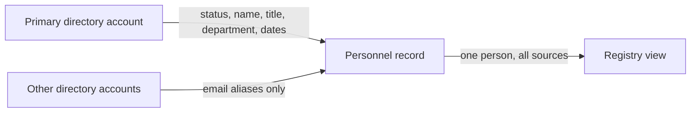

# Directory Sync and Identity Resolution

When you connect identity integrations such as [Google Workspace](../../integrations/google_workspace.mdx), [Azure Entra ID](../../integrations/azure_entra_id.mdx), or [Authentik](../../integrations/authentik.mdx), each sync pulls that directory's accounts into Openlane. The same person usually exists in several of these systems at once, so ingestion is followed by identity resolution: matching every synced account to a single [personnel record](./overview.mdx) (identity holder), no matter how many directories they appear in.

## What a Sync Brings In

Each sync run records the accounts, groups, and group memberships the provider reports, normalized to a common shape: a primary (canonical) email, any alias emails, name fields, title and department, and the account's lifecycle status in that directory. Accounts are keyed by the provider's stable identifier, so re-running a sync updates the same records rather than duplicating them, and memberships that disappear from the directory are marked removed after the run confirms what still exists.

Directory accounts are the raw per-source records. What you work with day to day is the personnel record each of them links to.

## How Accounts Are Matched to People

After an account is created or updated by a sync, resolution runs through a priority-ordered cascade and stops at the first match. Matching is scoped to your organization and always exact; nothing fuzzy-matches on email.

Two details in the cascade are deliberate. Aliases count: matching considers every email on both sides, the account's primary address plus its aliases against each personnel record's email plus its aliases, so a person whose GitHub account uses a personal alias still resolves to the same record as their Workspace account when either side knows about the shared address. And name matching refuses to guess: the last resort matches on exact first and last name only when exactly one person fits, so if two people named Jordan Smith already exist, the account gets a new record you can merge deliberately rather than a coin-flip link.

Accounts with no primary email at all (some service or system accounts) stay as directory records without a personnel record.

## The Primary Directory Decides the Facts

You can designate one identity integration as your **primary directory**. That designation controls field authority on the personnel record:

### Primary directory accounts

Populate the authoritative fields: status and active flag, title, department, phone, avatar, external user ID, and start and end dates derived from when the directory added or removed the account. The record's lifecycle follows your source of truth.

### Every other source

Contributes email aliases only. A Slack or GitHub account linking to the person adds its addresses to the record's alias list but never overwrites the title or status your primary directory reported.

After every link, the person's alias list is rebuilt from all of their linked accounts, with the primary email excluded, so the record carries every address the person is known by across your stack.

## What This Looks Like in the Registry

One person, however many directories they live in, appears as a single personnel record with their linked directory accounts underneath it. The record shows the authoritative facts from your primary directory, the full set of known email addresses, and which integrations the person was seen in, so an access review or offboarding check works from one row instead of a cross-referencing exercise across systems.

A few lifecycle behaviors worth knowing:

| Event | What happens |
| ----- | ------------ |
| Deactivation in the primary directory | The person's status updates and the active flag drops, but the record and its history remain, which is exactly what offboarding evidence needs |
| A directory account is deleted or an integration disconnected | Its addresses leave the person's alias list; the personnel record itself stays |
| A personnel record is deleted | Its directory accounts unlink; if they sync again later, resolution runs fresh and the person reappears with a new record |
| Two syncs race to create the same person | One record wins and both accounts link to it; simultaneous syncs do not produce duplicates |

## FAQ

Why do I see two records for the same person?

The directories disagreed on every email address and the name match was either unavailable or ambiguous. Check whether one source uses an address the other doesn't know about; adding the shared address as an alias in the directory (or merging the records and letting alias sync take over) resolves it going forward.

What happens if someone's email changes in the directory?

The account record updates on the next sync. If the account was already linked, the link holds and the new address joins the person's aliases. If it wasn't linked yet, resolution runs the cascade against the new address.

Do I have to pick a primary directory?

No, but without one, personnel records created by sync carry only names and emails; status, title, and department stay unset for you to manage manually. Designating the directory that HR reality actually lives in gets you a roster that maintains itself.

