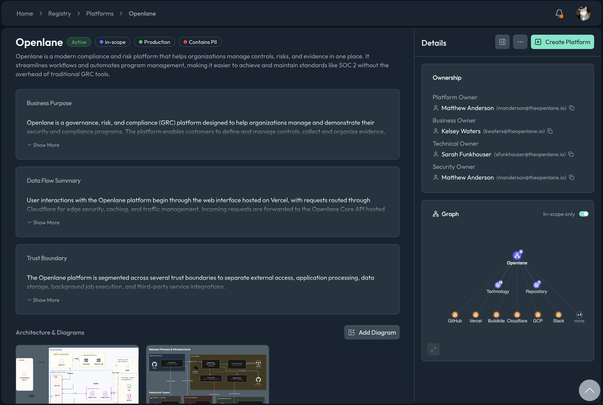

import Tabs from '@theme/Tabs';
import TabItem from '@theme/TabItem';

# Platforms

Platforms describe the governed systems in your program and the boundary around each one: what the system is, why it exists, who owns it, whether it handles PII, and what sits inside and outside its scope. A SOC 2 report is built around exactly this system description, and ISO 27001 requires a defined scope for the ISMS, so the boundary narrative is among the first things auditors ask for.

A platform record keeps that narrative and its supporting structure together: fields for the business purpose, scope statement, trust boundary description, and data flow summary, alongside uploaded architecture and data flow diagrams and the structured relationships that back them up. Platforms support SOC 2 system description and boundary definition (CC1, CC2, CC3), ISO 27001 A.5 and A.8, and audit scoping generally.



## How Platforms Work

Each platform record remembers how it entered the system, and its status is deliberately simple: Active for systems in service, Inactive for systems that are paused or dormant, and Retired for systems that have left the boundary but whose record you keep for the audit trail.

Ownership on a platform is role-based, because "who owns this system" is really several questions:

| Role | Answers |
| --- | --- |
| Business owner | Who is accountable for the system's purpose and budget |
| Technical owner | Who runs and changes it |
| Security owner | Who answers for its security posture |
| Internal owner | Who maintains this record in the program |

Each role can be a user, a group, or a named person when no account is linked. Classification fields (environment, criticality, data classification, and more) draw from your organization's [custom enums](../settings/custom-data.mdx), and diagrams live directly on the record: you can upload architecture, data flow, and trust boundary diagrams so the visual documentation stays with the system it describes.

Because a platform models a boundary, its relationships do the scoping work: it relates to the [assets](./assets.mdx) inside it (and, separately, to assets explicitly out of scope), the vendor [entities](./entities.mdx) it depends on or excludes, and the frameworks, controls, and evidence that make up its governance. Platforms connected through an identity integration also hold the directory accounts and groups synced from that provider. For the complete field list, see the [GraphQL object reference](/graphql).

## Working with Platforms

### Author the System Description

Create a platform for each system your audit covers and treat it as the single source for the system description: fill in the business purpose, scope statement, trust boundary description, and data flow summary, then upload the architecture, data flow, and trust boundary diagrams. Relate the assets that compose the system and the vendors it depends on. When audit prep starts, the narrative, the diagrams, and the structured inventory behind them are already in one place and already consistent with each other.

### Make Scope Decisions Explicit

Scoping decisions you cannot show your reasoning for turn into fieldwork friction. Platforms let you record exclusions, not just inclusions: relate the assets and vendors that are deliberately out of scope for a platform, and state the rationale in the scope statement. "We considered it and excluded it because" is a much stronger audit position than an omission the auditor discovers independently.

### Assign the Ownership Roles

Fill all the ownership roles rather than defaulting everything to one person. The business, technical, and security owner distinction matters most during an audit or incident, when "who decides", "who fixes", and "who answers for the risk" are asked in quick succession and are rarely the same person. Groups work as owners too, so a team can hold a role without the record breaking every time an individual changes jobs.

### Retire Systems Deliberately

When a system is decommissioned, set its status to Retired rather than deleting the record. The audit period almost certainly overlaps the system's lifetime, and a retired platform keeps its scope statement, relationships, and evidence available for exactly that window. It also keeps your active boundary honest: filtering platforms by status shows the auditor a scope that matches reality.

## FAQ

<details>
<summary>When should something be a platform instead of an asset?</summary>

Use a platform when the thing has a boundary worth describing: it appears in your system description, has its own owners, and contains or depends on other resources. Use an [asset](./assets.mdx) for the individual resources themselves. A rule of thumb: if an auditor would ask for its data flow diagram, it is a platform; if it would appear on that diagram, it is an asset.

</details>

<details>
<summary>Why does a platform have multiple owner roles?</summary>

Because audits and incidents ask different ownership questions. The business owner is accountable for why the system exists, the technical owner for how it runs, and the security owner for its risk posture. Collapsing these into one name works only until the questions arrive faster than one person can answer them. Assign groups where individual assignment is too brittle.

</details>

<details>
<summary>What should happen to a platform when the system is decommissioned?</summary>

Set the status to Retired and update the scope statement to say when and why. Do not delete it: the audit period likely covers time when the system was live, and the retired record preserves the relationships and evidence for that window while keeping it out of your active scope.

</details>

## Examples

<Tabs groupId="api-format" queryString>
  <TabItem value="csv" label="CSV">

```csv
# Create
Name,Description,Status,Region,ContainsPii
Production API,Customer-facing REST API,ACTIVE,us-east-1,true
Data Warehouse,Analytics and reporting store,ACTIVE,us-east-1,true
```

  </TabItem>
  <TabItem value="graphql" label="GraphQL">

```graphql
mutation {
  createPlatform(
    input: {
      name: "Production API"
      description: "Customer-facing REST API"
      containsPii: true
      region: "us-east-1"
    }
  ) {
    platform {
      id
      name
    }
  }
}
```

```graphql
mutation {
  updatePlatform(
    id: "PLT01J9ABCD111111111111111"
    input: {
      status: RETIRED
      scopeStatement: "Decommissioned as of Q1"
    }
  ) {
    platform {
      id
      status
    }
  }
}
```

  </TabItem>
  <TabItem value="go-client" label="Go Client">

```go
ctx := context.Background()

description := "Customer-facing REST API"
region := "us-east-1"
containsPII := true

_, err := client.CreatePlatform(ctx, graphclient.CreatePlatformInput{
	Name:        "Production API",
	Description: &description,
	Region:      &region,
	ContainsPii: &containsPII,
})
if err != nil {
	return err
}
```

  </TabItem>
  <TabItem value="cli" label="CLI">

```bash
openlane platform create \
  --name "Production API" \
  --description "Customer-facing REST API" \
  --environment "production" \
  --technical-owner "USR01J9ABCD111111111111111"

openlane platform update \
  --id "PLT01J9ABCD111111111111111" \
  --description "Decommissioned as of Q1"
```

  </TabItem>
</Tabs>
