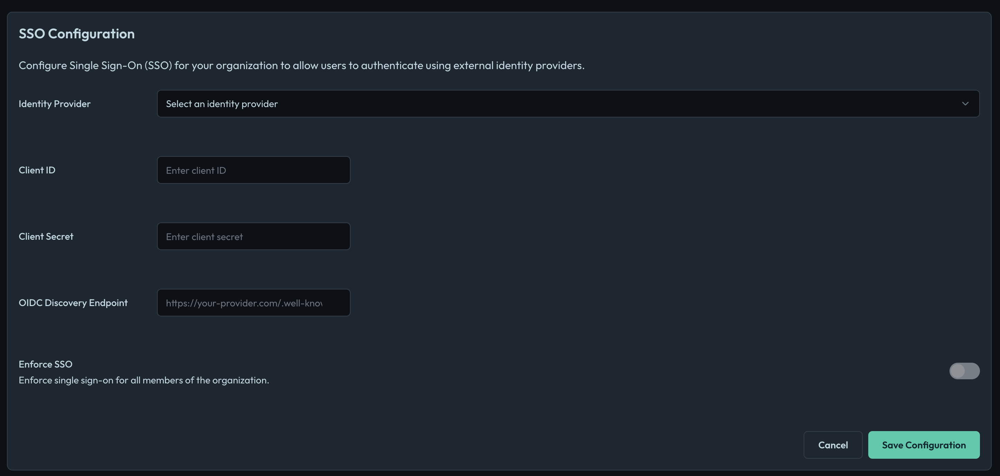

import Tabs from '@theme/Tabs';
import TabItem from '@theme/TabItem';

Openlane supports **OIDC (OpenID Connect)** for Single Sign-On (SSO). You will need these values from your identity provider (IdP) to configure SSO in Openlane. These are typically found in the application settings of your IdP

| **Field**                       | **Definition** |
|---------------------------------|----------------|
| **Client ID** | The public identifier for your application, obtained from your IdP. |
| **Client Secret** | A confidential secret known only to your application and the IdP, used to authenticate your application. |
| **OIDC Discovery Endpoint** | The URL where Openlane can retrieve the IdP's configuration, typically ending with `/.well-known/openid-configuration`. |

Once you have these, go to **Organization Settings** → [**Authentication**](https://console.theopenlane.io/organization-settings/authentication) in Openlane and enter the values.


## Redirect URI

```text
https://console.theopenlane.io/login/sso
```

## Setup Instructions by Provider

:::info
Thee details will vary slightly based on which provider you choose, but the general steps are the same. For questions about specific providers, please refer to their documentation or reach out to our [support team](https://support.devrev.ai/openlane) to assist.
:::

<Tabs groupId="sso-provider">

<TabItem value="google" label="Google">

1. Google Cloud Console → **APIs & Services → Credentials** → **Create Credentials → OAuth client ID (Web Application)**.
1. Add `https://console.theopenlane.io/login/sso` to **Authorized redirect URIs**.
1. Copy **Client ID** and **Client Secret**.
1. **OIDC Discovery Endpoint:**

```text
https://accounts.google.com/.well-known/openid-configuration
```

</TabItem>

</Tabs>

---

## Finish in Openlane
1. Go to **Organization Settings** → [**Authentication**](https://console.theopenlane.io/organization-settings/authentication).

    

1. Choose the Identity Provider from the dropdown
1. Enter the **Client ID**, **Client Secret**, and **OIDC Discovery Endpoint** from above.
1. **Save Configuration** and then click **Test Connection**. This will redirect you to your IdP to authenticate, if successful, you will be redirected back to Openlane and see a success message.
1. **Enforce SSO** once you have tested the connection. This will require all users to authenticate via SSO. Users without SSO access will be unable to log in, so ensure your IdP is configured correctly before enforcing. Only the organization owner can bypass SSO if needed.

    

## Troubleshooting

- **Invalid discovery URL** → Verify the exact `.well-known/openid-configuration` path and issuer domain for your IdP (Okta custom domains must reference the correct authorization server).
- **invalid_redirect_uri / login loop** → Ensure the Redirect URI matches *exactly* (scheme, host, path).