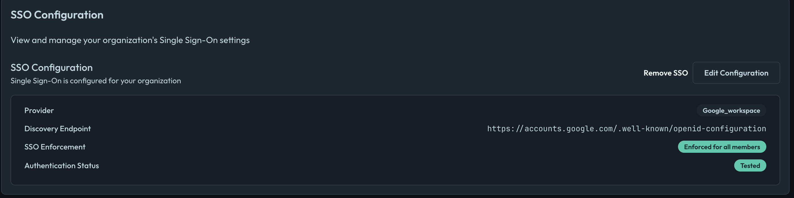

# Overview

Openlane supports **OIDC (OpenID Connect)** for Single Sign-On (SSO). You will need the below values from your identity provider (IdP) to configure SSO in Openlane.

## Prerequisites

| **Field**                       | **Definition** |
|---------------------------------|----------------|
| **Client ID** | The public identifier for your application, obtained from your IdP. |
| **Client Secret** | A confidential secret known only to your application and the IdP, used to authenticate your application. |
| **OIDC Discovery Endpoint** | The URL where Openlane can retrieve the IdP's configuration, typically ending with `/.well-known/openid-configuration`. |

## Setup Instructions

:::info
    Thee details will vary slightly based on which provider you choose, but the general steps are the same. For questions about specific providers, please refer to their documentation.
:::

We'll use Google as an example for creating this configuration:

1. Inside Google Cloud Console:
    - **APIs & Services → Credentials** → **Create Credentials → OAuth client ID (Web Application)**
1. Add `https://console.theopenlane.io/login/sso` to **Authorized redirect URIs**
1. Copy **Client ID** and **Client Secret**
1. Navigate to Openlane → **Organization Settings** → [**Authentication**](https://console.theopenlane.io/organization-settings/authentication)

1. Choose the Identity Provider from the dropdown
1. Enter the **Client ID**, **Client Secret**, and **OIDC Discovery Endpoint** from the step where you created them within the Google Console (Google's Disocvery endpoint is `https://accounts.google.com/.well-known/openid-configuration` for reference)
1. **Save Configuration** and then click **Test Connection**. This will redirect you to your IdP to authenticate and after authentication you will be redirected back to Openlane and see a success message if you've configured everything successfully
1. **Enforce SSO** only once you have tested the connection! This will require all users in your organization to authenticate via SSO. Users without SSO access will be unable to log in, so ensure your IdP is configured correctly before enforcing. Only the organization owner can bypass SSO.

## FAQ

### What is OIDC and how is it different from SAML or plain OAuth 2.0?

OIDC is an identity layer on OAuth 2.0 that standardizes authentication via JSON/JWTs. Compared to SAML (XML/browser posts), it’s lighter; unlike plain OAuth, OIDC provides an ID token that asserts identity. Read more [here](https://openid.net/developers/how-connect-works/).

### Which identity providers (IdPs) are supported?

Any standards-compliant OIDC IdP. We do not depend on a specific vendor.

### How is offboarding handled?

Disabling/removing a user in the IdP prevents further authentication across all integrated apps (including Openlane).

### Can contractors or external users authenticate?

Yes, as long as they exist as users within your IdP. If you do NOT enforce SSO, you can invite any user into your organization but it's recommended that you manage these users within your identity provider to ensure seamless and centralized control for access.

## Troubleshooting

- **Invalid discovery URL** → Verify the exact `.well-known/openid-configuration` path and issuer domain for your IdP (Okta custom domains must reference the correct authorization server)
- **invalid_redirect_uri / login loop** → Ensure the Redirect URI matches *exactly* (scheme, host, path)
