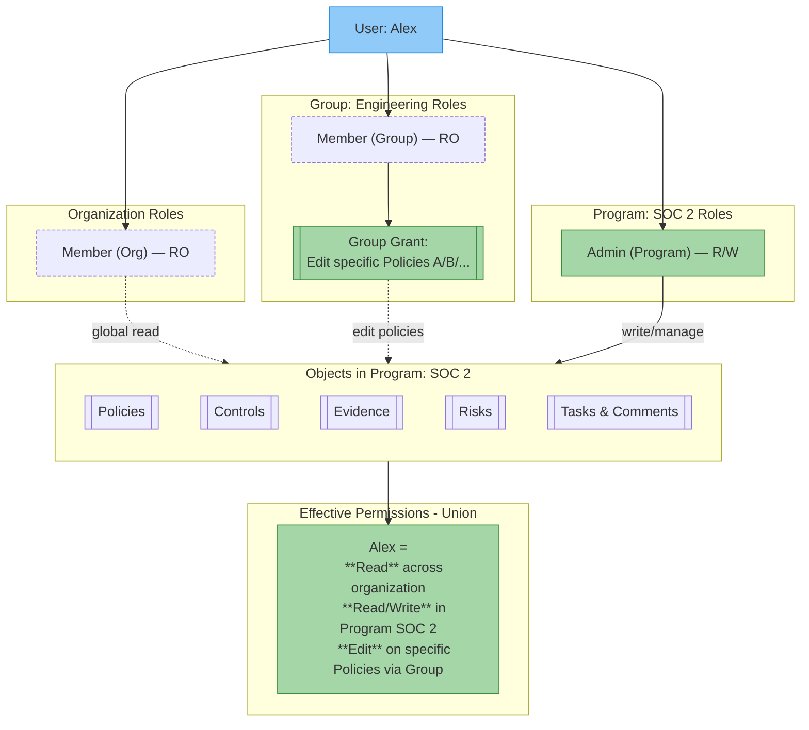

# Permissions Model

This document provides a comprehensive overview of the Openlane permissions model, including all object types, roles, and their respective permissions.
Openlane’s model leverages **role-based permissions**, **inheritance**, and **granular access controls** to define who can view or modify system objects.

## Roles and Access Model

Permissions in Openlane are based on roles that can be assigned at multiple levels:

- **Organization**: defines global access across the entire organization
- **Group**: allows for managing permissions for collections of users
- **Program**: allows scoping permissions to a specific compliance program

Each level supports a common set of roles (Admin and Member), which provide either read and write or read access by default to objects within that scope. Permissions can be **cumulative**: for example, a user who is an organization member but a program admin will have read access across the org and write access inside that specific program.

## Key Roles within an organization

- **Owner**: Full control over the organization and its resources.
- **Admin**: Read and write access to manage the organizations objects and members
- **Member**: Read only access, by default, to most objects within the organization
- **Auditor**: Granular read access to specific objects as defined by the organization owner or admins
- **Audit Log Viewer**: Read access to audit logs only

### Default Organization Roles and Permissions

| **Permission / Action**                          | **Owner** | **Admin** | **Member** |
|--------------------------------------------------|-----------|-----------|-----------|
| **Manage organization settings**                 | ✅        | ✅        | -       |
| **Setup and enforce SSO**                        | ✅        | ✅        | -       |
| **Manage billing and subscriptions**                | ✅        | ✅        | -       |
| **Add and remove organization admins**             | ✅        | ✅        | -       |
| **Invite organization members**                  | ✅        | ✅        | ✅      |
| **Assign org level permissions**                 | ✅        | ✅        | -       |
| **Bypass SSO requirements**                      | ✅        | -       | -       |
| **View audit logs**                              | ✅        | -       | -       |
| **Transfer ownership / delete organization**     | ✅        | -       | -       |
| **Create programs**                     | ✅        | ✅         | -       |
| **Manage existing programs**                     | ✅        | ✅ (program admins only)         | -       |
| **View all programs**                            | ✅        | -         | -       |
| **Create groups**                       | ✅        | ✅ | - |
| **Manage group membership**                      | ✅        | ✅ (group admins only)         | -       |
| **Create policies and procedures**     | ✅        | ✅        | -       |
| **View existing policies and procedures**      | ✅        | ✅        | ✅  |
| **Create risks**                        | ✅        | ✅        | -       |
| **View existing risks**                          | ✅        | ✅        | - |
| **Import or create controls**            | ✅        | ✅        | -       |
| **View existing controls**                       | ✅        | ✅        | ✅   |
| **Create tasks, comments**    | ✅        | ✅        | ✅        |
| **Upload evidence**                      | ✅        | ✅        | ✅ (limited)      |

The above are the default permissions associated with each role. Additional permissions can be granted to members or groups for specific objects, allowing for more granular control over access and actions within the organization.

## Role Details

### Owner  (Organization-Level Only)

The organization owner has the highest level of access and can perform all actions, including:

:::info
Each organization can only have one owner.
:::

- Managing organization settings
- Managing billing and subscription details
- Adding, removing, or reassigning members
- Assigning roles and permissions, including creating and maintaining groups
- Accessing all data and resources, even if not explicitly granted (e.g. viewing any program regardless of membership)
- Bypassing organization SSO requirements
- Viewing all audit logs
- Creation of all object types
- Transferring ownership to another member
- Deletion of the organization

### Admin

Admins have broad write access and management capabilities:

- Manage organization settings, billing, and subscription details
- Create and manage most objects, including programs, controls, policies, procedures, evidence, risks, and control mappings
- Add and remove members, assign roles, and invite users
- Create groups and assign members during group creation (after creation, only group admins or the organization owner can manage group membership)

:::note
Admins exist at multiple levels (Organization, Group, Program).
A group admin can manage the membership of that group; a program admin can manage settings, controls, and evidence within that program.
:::

### Member

Members have read access by default, with limited write actions:

- View all public groups in the organization
- View all policies, procedures, and controls (unless explicitly restricted)
- Create tasks and add comments
- Upload evidence to controls they have access to or by task assignment
- Invite other members (but cannot assign roles or invite admins)
- Gain additional access through group membership or program-level roles

:::note
Members do **not** have access to programs by default and must be added explicitly.
:::

### Auditor (Coming Soon)

Auditors can be granted **granular read-only access** to compliance-related data, including:

- Programs
- Policies, procedures, and controls
- Risks
- Evidence (including downloads)
- Tasks and comments

This allows external auditors to review information without the ability to make changes.

### Audit Log Viewer (Coming Soon)

Provides read-only access to audit logs without granting broader organization permissions.
By default, only the owner can view logs, but they may assign other users, regardless of their role in the organization, this role.

## Assigning Additional Permissions

In addition to the default permissions associated with each role, organization owners and admins can assign additional permissions to members or groups for specific objects. This allows for more granular control over access and actions within the organization.

## Groups and Programs

Groups and programs support the same role structure as the organization:

- **Admin**: Manage group or program membership, settings, and related objects
- **Member**: Read-only access by default to the group's or program's objects

This allows you to delegate permissions at a more granular level without granting full organization-wide access.
For example:

- A **program admin** can manage controls, policies, and evidence within that program
- A **group member** can gain read or write access to objects assigned to the group (inheritance)

See [Groups and Permissions](../../basics/groups/permissions.mdx) for detailed guidance.

### Object Creation Permissions

In addition to role-based access, owners and admins can grant:

- **Object-specific permissions** to groups (e.g. granting edit rights to a single control)
- **Object creation rights** to groups (e.g. allowing a group to create policies, risks, evidence, etc. within the organization)

This cannot currently be done via the UI, however, the API supports this functionality. Refer to the [GraphQL examples](graphql.mdx) for more information.