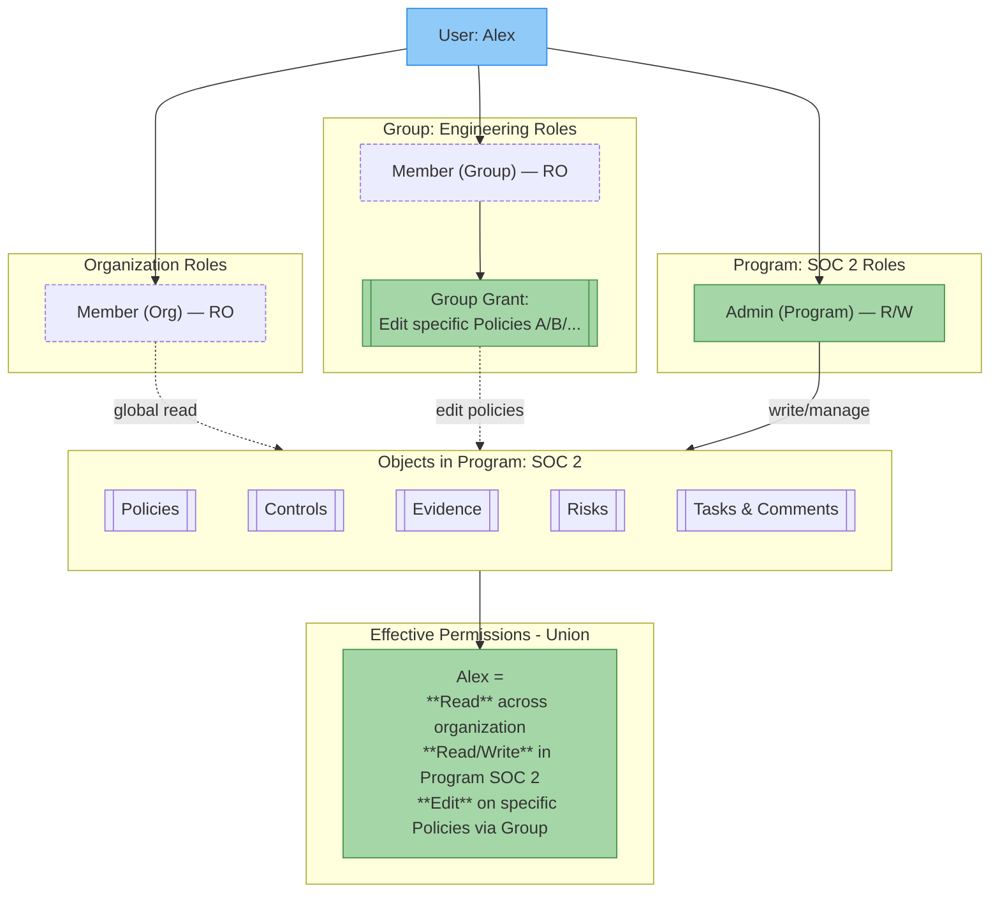

# Permissions Model

This document provides a comprehensive overview of the Openlane permissions model, including all object types, roles, and their respective permissions.
Openlane’s model leverages **role-based permissions**, **inheritance**, and **granular access controls** to define who can view or modify system objects.

## Roles and Access Model

Permissions in Openlane are based on roles that can be assigned at multiple levels:

- **Organization**: defines global access across the entire organization
- **Group**: allows for managing permissions for collections of users
- **Program**: allows scoping permissions to a specific compliance program

Each level supports a common set of roles (Admin and Member), which provide either read and write or read access by default to objects within that scope. Permissions can be **cumulative**: for example, a user who is an organization member but a program admin will have read access across the org and write access inside that specific program.

## Base Roles

Every user in Openlane is assigned exactly one base role at the organization level. Base roles establish the default permission floor — what a user can see and do across the organization before any additional access is layered on.

| Role | Count | Summary |
|---|---|---|
| **Owner** | 1 per org | Full access; only role that can delete the organization or transfer ownership |
| **Super Admin** | Unlimited | Full access to all objects and actions except organization deletion |
| **Admin** | Unlimited | Create and manage objects; view access to programs (edit requires program admin assignment); manages trust center, integrations, registry, and exposure |
| **Member** | Unlimited | Default read access; can create evidence and tasks |
| **Auditor** | Unlimited | Limited read access; full access to evidence; can create comments, discussions, and tasks |

### Default Organization Permissions by Role

| Icon | Meaning |
|:---:|---|
| 🟢 | Full access — create, edit, delete |
| 🔵 | Read only |
| 🟡 | Create / upload only |
| - | No access |

| **Object / Feature** | **Owner** | **Super Admin** | **Admin** | **Member** | **Auditor** |
|---|:---:|:---:|:---:|:---:|:---:|
| **Org settings & SSO** | 🟢 | 🟢 | 🟢 | - | - |
| **Billing & subscriptions** | 🟢 | 🟢 | - | - | - |
| **Member management & roles** | 🟢 | 🟢 | 🟢 | 🔵 | - |
| **Member invites** | 🟢 | 🟢 | 🟢 | 🟢 | - |
| **Object Audit logs** | 🔵 | 🔵 | 🔵 | 🔵 | - |
| **Bypass SSO** | 🟢 | - | - | - | - |
| **Transfer ownership** | 🟢 | - | - | - | - |
| **Delete organization** | 🟢 | - | - | - | - |
| **Programs** ¹ | 🟢 | 🟢 | 🔵 | - | 🔵 |
| **Controls** | 🟢 | 🟢 | 🟢 | 🔵 | 🔵 |
| **Policies & procedures** | 🟢 | 🟢 | 🟢 | 🔵 | 🔵 |
| **Risks** | 🟢 | 🟢 | 🟢 | - | 🔵 |
| **Evidence** | 🟢 | 🟢 | 🟢 | 🟡 | 🟢 |
| **Reviews** | 🟢 | 🟢 | 🟢 | 🔵 | 🟢 |
| **Tasks & comments** | 🟢 | 🟢 | 🟢 | 🟢 | 🟢 |
| **Groups** | 🟢 | 🟢 | 🟢 | 🔵 | 🔵 |
| **Integrations** | 🟢 | 🟢 | 🟢 | 🔵 | - |
| **Trust center** | 🟢 | 🟢 | 🟢 | 🔵 | - |
| **Registry** (assets, entities, contacts) | 🟢 | 🟢 | 🟢 | 🔵 | - |
| **Exposure** (vulnerabilities, findings, scans) | 🟢 | 🟢 | 🟢 | 🔵 | - |

¹ Admins can create programs and have view access by default. Edit access requires being assigned as a program admin on the specific program.

The above are the defaults for each base role. Additional access can be granted through group membership, program-level role assignment, or functional roles.

## Role Details

### Owner (Organization-Level Only)

The organization owner has the highest level of access and can perform all actions, including:

:::info
Each organization can only have one owner. Ownership can be transferred to another member but not shared.
:::

- Managing organization settings, billing, and subscription details
- Adding, removing, or reassigning members and roles
- Accessing all data and resources regardless of explicit assignment (e.g. viewing any program)
- Bypassing organization SSO requirements
- Viewing all audit logs
- Creating all object types
- Transferring ownership to another member
- Deleting the organization

### Super Admin

Super admins have the same permissions as the owner with one exception:

- Full access to all objects, actions, and settings across the organization
- Can delete the organization: **no**
- Can transfer ownership: **no**

:::note
Super admin is appropriate for trusted administrators who need full operational access without holding the single ownership seat.
:::

### Admin

Admins have broad create and manage access with a few scoped restrictions:

- Create and manage most objects: policies, procedures, controls, risks, evidence, and control mappings
- Read/write/delete access to policies, controls, and risks by default
- Default **view** access to programs — edit access requires being assigned as a program admin on the specific program
- Manage trust center, integrations, registry (assets, entities, contacts, platforms), and exposure (risks, vulnerabilities, findings)
- Add and remove members, assign roles, and invite users
- Create groups and assign members at creation time (post-creation group membership is managed by group admins or the owner)

:::note
Admins exist at multiple levels: organization, group, and program. A group admin manages that group's membership; a program admin manages settings, controls, and evidence within that program.
:::

### Member

Members have read access by default with limited write actions:

- View policies, procedures, and controls across the organization
- Create tasks and add comments
- Upload evidence to controls they have access to or via task assignment
- Invite other members (cannot assign roles or invite admins)
- Gain additional access through group membership, program assignment, or a functional role

:::note
Members do **not** have access to programs by default and must be explicitly added to a program.
:::

### Auditor (Coming Soon)

Auditors have limited read access scoped to compliance-relevant objects, plus full access to evidence:

- View: programs, policies, procedures, controls, subcontrols, evidence, and reviews
- Full CRUD on evidence and reviews
- Create comments, discussions, and tasks

This allows external or internal auditors to review compliance data and work with evidence without the ability to modify other objects.

## Functional Roles

Functional roles are **additive** — they are assigned on top of a base role to extend permissions for a specific domain. They are available to admins, members, and auditors; owners and super admins already have full access and do not require functional role assignments.

| **Role** | **Description** | **Objects Managed** |
|---|---|---|
| **Compliance Manager** | Full manage access to compliance programs, controls, and evidence. Also inherits policy, registry, and risk management capabilities. | Controls, subcontrols, programs, evidence, narratives, standards, control objectives, control implementations, mapped controls |
| **Risk Manager** | Full manage access to the risk and exposure domain | Risks, vulnerabilities, scans, findings, action plans, remediation plans, reviews |
| **Policy Manager** | Full manage access to policies and procedures | Internal policies, procedures |
| **Registry Manager** | Full manage access to the asset and entity registry | Assets, entities, contacts, identity holders, platforms, system details |
| **Group Manager** | Full manage access to organization groups | Groups |
| **Trust Center Manager** | Full manage access to trust center content | Trust center pages, documents, FAQs, subprocessors, compliance entries, entities, NDA requests, watermark config |
| **Workflow Manager** | Full manage access to automation and integrations | Workflow definitions, scheduled jobs, job runners, job templates, integrations, integration webhooks |
| **Campaign Manager** | Full manage access to campaigns and assessments | Campaigns, assessments, templates, email templates, email branding, notification templates |

:::note
Functional roles grant access to their specific domain only — a Policy Manager cannot manage risks, and a Risk Manager cannot manage policies unless they also hold the Compliance Manager role (which inherits both).
:::

## Assigning Additional Permissions

In addition to the default permissions associated with each role, organization owners and admins can assign additional permissions to members or groups for specific objects. This allows for more granular control over access and actions within the organization.

## Groups and Programs

Groups and programs support the same role structure as the organization:

- **Admin**: Manage group or program membership, settings, and related objects
- **Member**: Read-only access by default to the group's or program's objects

This allows you to delegate permissions at a more granular level without granting full organization-wide access.
For example:

- A **program admin** can manage controls, policies, and evidence within that program
- A **group member** can gain read or write access to objects assigned to the group (inheritance)

```mermaid
flowchart TB
 subgraph ORG["Organization Roles"]
    direction TB
        OMember["Member (Org) — RO"]
  end
 subgraph GRP["Group: Engineering Roles"]
    direction TB
        GMember["Member (Group) — RO"]
        GGrant[["Group Grant:
        Edit specific Policies A/B/..."]]
  end
 subgraph PRG["Program: SOC 2 Roles"]
    direction TB
        PAdmin["Admin (Program) — R/W"]
  end
 subgraph OBJS["Objects in Program: SOC 2"]
    direction TB
        Policies[["Policies"]]
        Controls[["Controls"]]
        Evidence[["Evidence"]]
        Risks[["Risks"]]
        Tasks[["Tasks & Comments"]]
  end
 subgraph RESULT["Effective Permissions - Union"]
    direction TB
        Eff["Alex =
    **Read** across organization
    **Read/Write** in Program SOC 2
    **Edit** on specific Policies via Group"]
  end
    User["User: Alex"] --> OMember & GMember & PAdmin
    OMember -. global read .-> OBJS
    GGrant -. edit policies .-> OBJS
    PAdmin -- write/manage --> OBJS
    GMember --> GGrant
    OBJS --> Eff
     OMember:::ro
     GMember:::ro
     GGrant:::rw
     PAdmin:::rw
     Eff:::rw
     User:::user
    classDef user fill:#90caf9,stroke:#1e88e5,color:#333
    classDef rw fill:#a5d6a7,stroke:#388e3c,color:#333
    classDef ro stroke-dasharray:4 2
```

See [Groups and Permissions](../../basics/groups/permissions.mdx) for detailed guidance.

### Object Creation Permissions

In addition to role-based access, owners and admins can grant:

- **Object-specific permissions** to groups (e.g. granting edit rights to a single control)
- **Object creation rights** to groups (e.g. allowing a group to create policies, risks, evidence, etc. within the organization)

This cannot currently be done via the UI, however, the API supports this functionality. Refer to the [GraphQL examples](graphql.mdx) for more information.

## Frequently Asked Questions

**Can I give a Member write access to a specific record without making them an Admin?**

Yes. Add the member to a group, and set that group as an **Editor** on the specific record. Their base role stays as Member, but they'll have edit access to that record only.

**Can I restrict an Admin from seeing a particular record?**

Yes. Add the Admin to a group, and set that group as a **Blocked group** on the record. The block takes precedence over their role.

**Can an Auditor be given write access?**

The Auditor role includes create permissions for evidence, reviews, tasks, and discussions. Beyond that, write access requires a different base role or a functional role.

**What happens if someone is removed from the organization?**

Their access is revoked immediately. Any API tokens they created remain active until explicitly revoked by an Admin or above.

**What's the difference between Admin and Super Admin?**

The two key differences are billing access and organization deletion. Admins cannot manage billing or subscriptions and cannot delete the organization. Super Admins have full operational access equivalent to the Owner, with the exception that they cannot delete the organization or transfer ownership. Super Admin is appropriate for trusted administrators who need broad access without holding the single ownership seat.

**Can a Member be assigned as a program admin?**

Yes. Base role and program role are independent. A Member can be explicitly assigned as a program admin, giving them full edit access within that program while retaining their read-only base role everywhere else in the organization. This is a common pattern for users who own a specific compliance program but don't need broader write access.

**Can functional roles be assigned to groups?**

Yes. Assigning a functional role to a group is the recommended way to grant domain-specific access to a team. For example, adding your security team group as Risk Manager means every member of that group gets risk and exposure management access without needing individual role assignments.

**What happens to a user's access if their base role is downgraded?**

Access is updated immediately. If a user is downgraded from Admin to Member, they lose all write access granted by the Admin role. Any functional roles they held are also reviewed — functional roles assigned to their previous base role context may need to be explicitly re-evaluated. Program and group memberships are not automatically removed and should be reviewed separately.

**Can there be more than one Super Admin?**

Yes. Unlike Owner, which is limited to exactly one user per organization, Super Admin can be assigned to any number of users. There is no cap on Super Admin seats.

