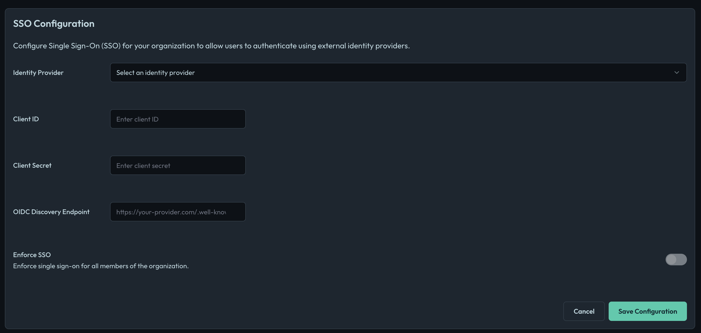
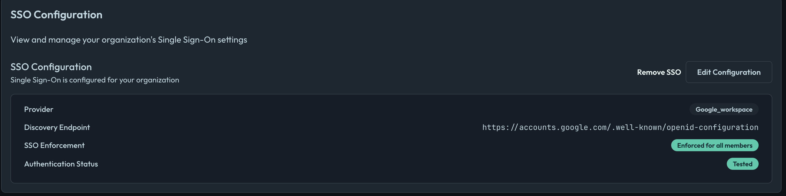
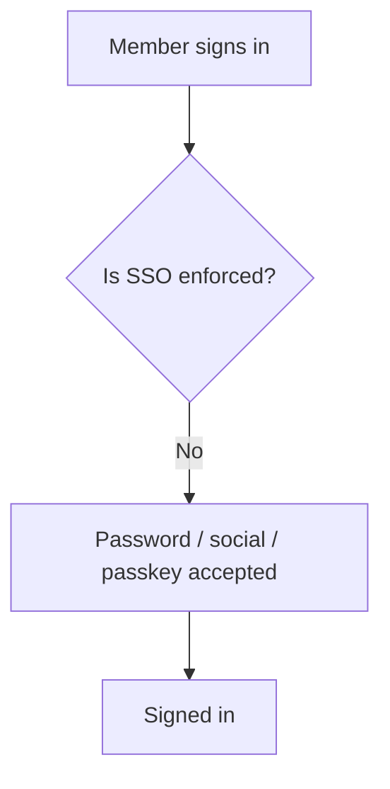
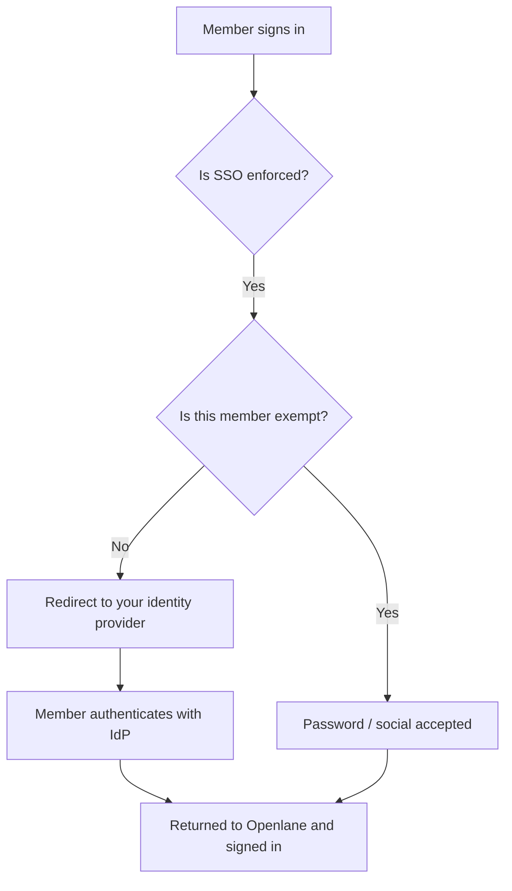
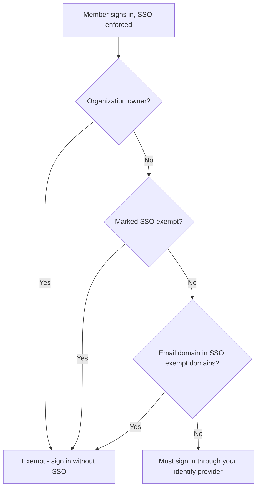
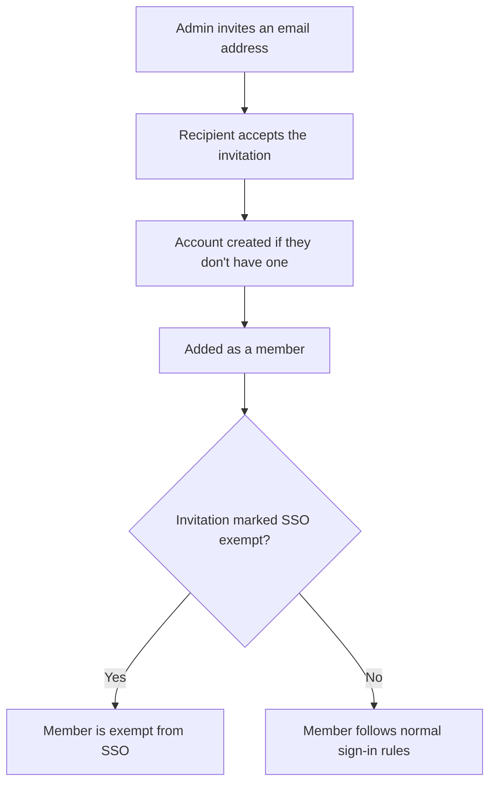
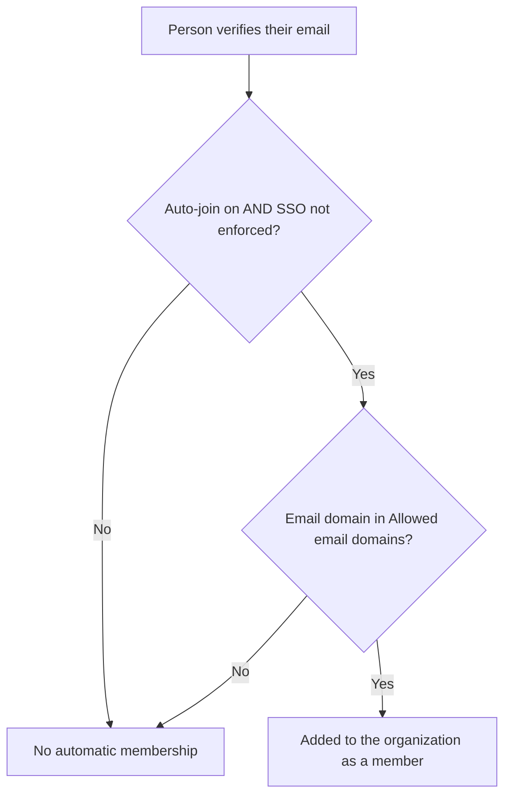
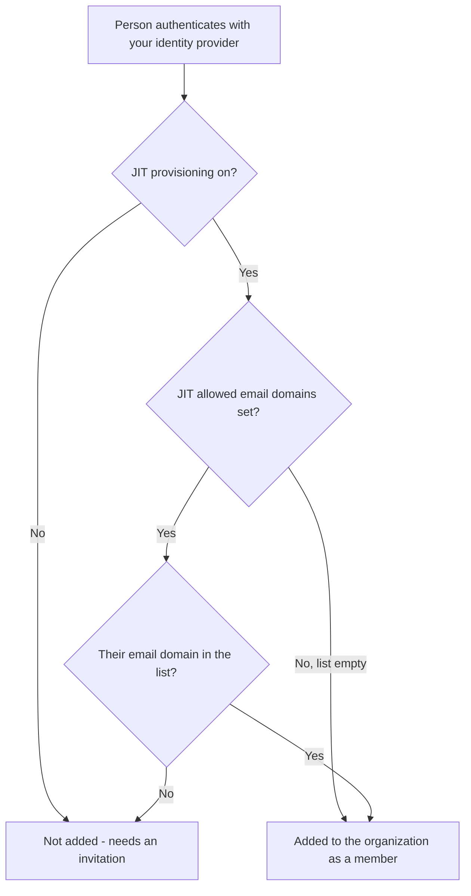
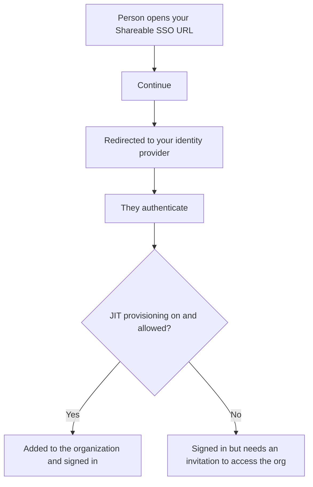

import Steps from '@site/src/components/Steps';

# Single Sign-On (SSO)

Openlane supports **OIDC (OpenID Connect)** for Single Sign-On (SSO). You will need the following values from your identity provider (IdP) to configure SSO in Openlane.

## Prerequisites

| **Field**                       | **Definition** |
|---------------------------------|----------------|
| **Client ID** | The public identifier for your application, obtained from your IdP. |
| **Client Secret** | A confidential secret known only to your application and the IdP, used to authenticate your application. |
| **OIDC Discovery Endpoint** | The URL where Openlane can retrieve the IdP's configuration, typically ending with `/.well-known/openid-configuration`. |

## Setup Instructions

:::info
    These details will vary slightly based on which provider you choose, but the general steps are the same. For questions about specific providers, please refer to their documentation.
:::

We'll use Google as an example for creating this configuration:

<Steps>

1. Inside Google Cloud Console:
    - **APIs & Services → Credentials** → **Create Credentials → OAuth client ID (Web Application)**
1. Add `https://console.theopenlane.io/login/sso` to **Authorized redirect URIs**
1. Copy **Client ID** and **Client Secret**
1. Navigate to Openlane → **Organization Settings** → [**Authentication**](https://console.theopenlane.io/settings/authentication)

</Steps>

<Steps>

1. Choose the Identity Provider from the dropdown
1. Enter the **Client ID**, **Client Secret**, and **OIDC Discovery Endpoint** from the step where you created them within the Google Console (Google's Discovery endpoint is `https://accounts.google.com/.well-known/openid-configuration` for reference)
1. **Save Configuration** and then click **Test Connection**. This redirects you to your IdP to authenticate; after authenticating, you are returned to Openlane and you should see a success message if everything is configured correctly
1. **Enforce SSO** only once you have tested the connection. This will require all users in your organization to authenticate via SSO. Users without SSO access will be unable to log in, so ensure your IdP is configured correctly before enforcing. Only the organization owner can bypass SSO.

</Steps>

## Settings reference

The Authentication settings page surfaces a handful of controls that, together, determine how people sign in to your organization and how they become members. This table is a quick reference; the sections that follow explain how they interact.

| **Setting** | **What it does** |
|-------------|------------------|
| **Identity provider configuration** | The Client ID, Client Secret, and OIDC Discovery Endpoint for your IdP. Required before SSO can be tested or enforced. |
| **Test connection** | Runs a real sign-in against your IdP. You must successfully test before you can enforce SSO. Changing any provider value clears the tested status and requires you to test again. |
| **Enforce SSO** | When on, members must sign in through your identity provider. Password and social (Google/GitHub) sign-in are no longer accepted for non-exempt members. |
| **Just-in-time (JIT) provisioning** | When SSO is enforced, anyone who successfully authenticates against your identity provider is automatically added to the organization as a member. |
| **JIT allowed email domains** | An optional allowlist that restricts JIT provisioning to people whose verified email domain is in the list. Left empty, anyone who can authenticate against your IdP is provisioned. |
| **Allowed email domains** | Email domains that may automatically join the organization when SSO is **not** enforced. |
| **Auto-join matching domains** | When on (and SSO is not enforced), people whose verified email domain is in **Allowed email domains** are added to the organization automatically. |
| **SSO exempt domains** | Email domains whose members skip the SSO redirect even when SSO is enforced. Useful for auditors or contractors who are not in your directory. |
| **Member SSO exemption** | A per-person exemption set from the Members page. That member can sign in without SSO even when enforcement is on. |
| **Shareable SSO URL** | A stable, copy-and-paste link that takes someone straight into your organization's SSO sign-in. |

:::note
Multi-factor authentication (MFA) is enforced independently of SSO. If your organization requires MFA, an exempt member who signs in without SSO is still required to satisfy MFA.
:::

## How sign-in works

The behavior of sign-in depends almost entirely on whether **Enforce SSO** is on, and whether the person signing in is exempt.

### SSO disabled

With SSO not configured (or configured but not enforced), members sign in with whatever method they prefer: password, Google, GitHub, or a passkey.

### SSO enforced

Once you enforce SSO, members are redirected to your identity provider before any password or social login is accepted. After they authenticate with your IdP, they're returned to Openlane and signed in.

### Exemptions

Even with SSO enforced, some people bypass the SSO redirect. Exemptions are evaluated in this order, and the first one that applies wins:

1. **Organization owner**: the owner is always exempt, so you can never lock yourself out.
1. **Member SSO exemption**: a specific member you've exempted from the Members page.
1. **SSO exempt domain**: any member whose email domain is in **SSO exempt domains**.

:::info
**SSO exempt domains** is a living rule. If you remove a domain from the list, members on that domain are immediately subject to SSO enforcement again the next time they sign in. A per-member exemption, by contrast, stays in place until you remove it from that member.
:::

## Getting people into your organization

There are three ways someone becomes a member of your organization. Which ones are available depends on your settings.

### Invitations

Invitations always work, regardless of your SSO settings. You invite someone by email; when they accept, they become a member. If you mark the invitation as SSO-exempt, the resulting member carries that exemption.

### Auto-join by email domain (SSO not enforced)

When SSO is **not** enforced, you can let people join automatically based on their email domain. Turn on **Auto-join matching domains** and list the domains under **Allowed email domains**. Anyone who verifies an email on one of those domains is added to the organization.

:::note
Auto-join by domain only applies when SSO is **not** enforced. When SSO is enforced, membership comes from your identity provider through JIT provisioning instead (below).
:::

### Just-in-time (JIT) provisioning (SSO enforced)

When SSO is enforced and **JIT provisioning** is on, anyone who successfully authenticates against your identity provider is added to the organization automatically, no invitation required. This is how new hires in your directory get access simply by signing in.

If you leave **JIT allowed email domains** empty, anyone who can authenticate against your IdP is provisioned. Set it to one or more domains to provision only those people; for example, to provision `@yourcompany.com` employees while excluding guest accounts that exist in the same directory.

### Choosing between auto-join and JIT

They serve the same goal (getting the right people in without manual invites) but apply in opposite configurations:

| | **Auto-join by domain** | **JIT provisioning** |
|---|---|---|
| Applies when | SSO is **not** enforced | SSO **is** enforced |
| Triggered by | Verifying an email on an allowed domain | Authenticating against your identity provider |
| Domain control | **Allowed email domains** | **JIT allowed email domains** |
| Source of truth | Email address | Your identity provider directory |

## Shareable SSO URL

Every organization has a stable **Shareable SSO URL** you can copy from the Authentication settings page and send to people. Opening it takes them straight into your organization's identity provider. After they authenticate, and if JIT provisioning is on, they're added to the organization and signed in. Because it's a normal link, it works from an email or chat message and doesn't require the person to already be a member.

## FAQ

What is OIDC and how is it different from SAML or plain OAuth 2.0?

OIDC is an identity layer on OAuth 2.0 that standardizes authentication via JSON/JWTs. Compared to SAML (XML/browser posts), it’s lighter; unlike plain OAuth, OIDC provides an ID token that asserts identity. Read more in the [OIDC overview](https://openid.net/developers/how-connect-works/).

Which identity providers (IdPs) are supported?

Any standards-compliant OIDC IdP. We do not depend on a specific vendor.

How is offboarding handled?

Disabling/removing a user in the IdP prevents further authentication across all integrated apps (including Openlane).

Can contractors or external users authenticate?

Yes. If they exist in your IdP, they sign in through SSO like everyone else. If they are **not** in your directory (for example an external auditor), add their email domain to **SSO exempt domains**, or grant them a per-member exemption, so they can sign in without SSO. You can also simply invite them when SSO is not enforced.

Why can the owner still sign in with a password after I enforced SSO?

The organization owner is always exempt from SSO so you can never lock yourself out of your own organization. This is expected.

I enforced SSO but a new colleague can't get in. Why?

With SSO enforced, new people only become members through **JIT provisioning** or an invitation. If JIT is off, invite them. If JIT is on but you've set **JIT allowed email domains**, make sure their email domain is in the list.

Do exempt members still need MFA?

Yes. Multi-factor authentication is enforced separately from SSO. An SSO-exempt member who signs in with a password still has to satisfy MFA if your organization requires it.

## Troubleshooting

| Symptom | Fix |
| --- | --- |
| **Invalid discovery URL** | Verify the exact `.well-known/openid-configuration` path and issuer domain for your IdP (Okta custom domains must reference the correct authorization server) |
| **invalid_redirect_uri / login loop** | Ensure the Redirect URI matches *exactly* (scheme, host, path) |
| **Can't turn on Enforce SSO** | You must run a successful **Test connection** first. If you recently changed any provider value, the tested status is cleared and you'll need to test again. |
| **A colleague signs in but lands in their personal organization** | They authenticated, but aren't a member of your organization. Turn on JIT provisioning (and confirm their domain is allowed), or invite them. |
