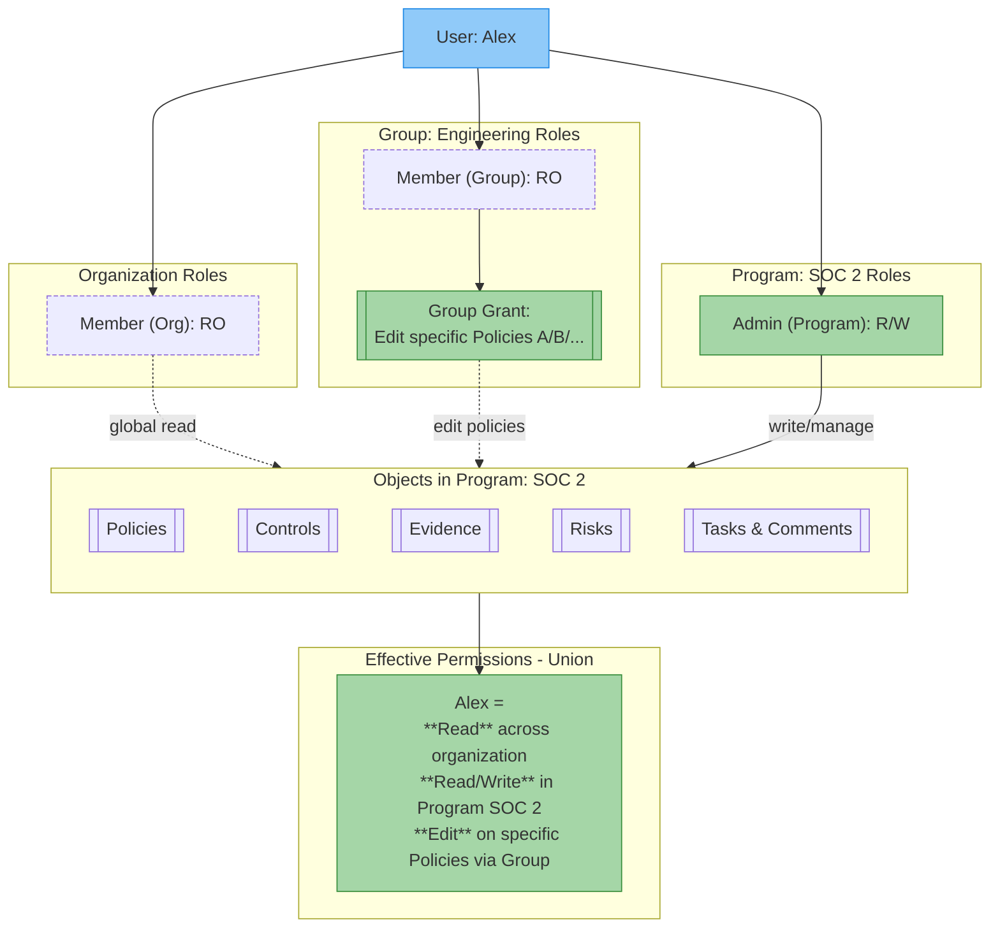

# Permissions Model

Openlane decides what each user can see and do through three things layered together: a **base role** at the organization level, **role assignments** on groups and programs, and **object-level grants**. Effective access is the union of all three, so you can keep most people at a read-only baseline and grant write access only where they actually work.

## How Access Is Layered

Roles can be assigned at three levels:

- **Organization**: global access across the entire organization
- **Group**: permissions for collections of users
- **Program**: permissions scoped to a specific compliance program

Each level supports a common set of roles (Admin and Member), providing read/write or read access to objects within that scope. Permissions are **cumulative**: a user who is an organization member but a program admin has read access across the org and write access inside that program.

## Base Roles

Every user holds exactly one base role at the organization level: the permission floor before anything else is layered on.

**Owner** (one per organization) has full access and is the only role that can delete the organization, transfer ownership, or bypass organization SSO requirements. Ownership can be transferred but never shared.

**Super Admin** matches the Owner everywhere else (full access to all objects, actions, and settings) but cannot delete the organization or transfer ownership. There is no cap on Super Admin seats; it's the right role for trusted administrators who need full operational access without holding the single ownership seat.

**Admin** creates and manages most objects (policies, procedures, controls, risks, evidence, control mappings), plus trust center, integrations, registry, and exposure. Admins manage members, roles, and invites, and can create groups (post-creation group membership is managed by group admins or the owner). Admins get **view** access to programs by default; editing a program requires being assigned as a program admin on it. Admins do not have billing access.

**Member** is the default read baseline: view policies, procedures, and controls; create tasks and comments; upload evidence where they have access or via task assignment; invite other members (but not assign roles or invite admins). Members have no program access until explicitly added.

**Auditor** (coming soon) gets limited read access scoped to compliance objects (programs, policies, procedures, controls, subcontrols), plus full access to evidence and reviews, and can create comments, discussions, and tasks. This lets external auditors review compliance data without the ability to modify anything else.

### Default Permissions by Role

Legend: **Full** = create, edit, delete · **Read** = read only · **Create** = create/upload only · - = no access

| **Object / Feature** | **Owner** | **Super Admin** | **Admin** | **Member** | **Auditor** |
|---|:---:|:---:|:---:|:---:|:---:|
| **Org settings & SSO** | Full | Full | Full | - | - |
| **Billing & subscriptions** | Full | Full | - | - | - |
| **Member management & roles** | Full | Full | Full | Read | - |
| **Member invites** | Full | Full | Full | Full | - |
| **Object Audit logs** | Read | Read | Read | Read | - |
| **Bypass SSO** | Full | - | - | - | - |
| **Transfer ownership** | Full | - | - | - | - |
| **Delete organization** | Full | - | - | - | - |
| **Programs** ¹ | Full | Full | Read | - | Read |
| **Controls** | Full | Full | Full | Read | Read |
| **Policies & procedures** | Full | Full | Full | Read | Read |
| **Risks** | Full | Full | Full | - | Read |
| **Evidence** | Full | Full | Full | Create | Full |
| **Reviews** | Full | Full | Full | Read | Full |
| **Tasks & comments** | Full | Full | Full | Full | Full |
| **Groups** | Full | Full | Full | Read | Read |
| **Integrations** | Full | Full | Full | Read | - |
| **Trust center** | Full | Full | Full | Read | - |
| **Registry** (assets, entities, contacts) | Full | Full | Full | Read | - |
| **Exposure** (vulnerabilities, findings, scans) | Full | Full | Full | Read | - |

¹ Admins can create programs and have view access by default. Edit access requires being assigned as a program admin on the specific program.

These are the defaults. Additional access layers on through group membership, program-level role assignment, or functional roles.

## Functional Roles

Functional roles are **additive**: assigned on top of a base role to extend permissions for one domain. They're available to admins, members, and auditors (owners and super admins already have full access):

| Functional Role | Grants Access To |
| --- | --- |
| **Compliance Manager** | Controls, subcontrols, programs, evidence, narratives, standards, control objectives, control implementations, and mapped controls; also inherits policy, registry, and risk management capabilities |
| **Risk Manager** | Risks, vulnerabilities, scans, findings, action plans, remediation plans, and reviews |
| **Policy Manager** | Internal policies and procedures |
| **Registry Manager** | Assets, entities, contacts, identity holders, platforms, and system details |
| **Group Manager** | Organization groups |
| **Trust Center Manager** | Trust center pages, documents, FAQs, subprocessors, compliance entries, entities, NDA requests, and watermark configuration |
| **Workflow Manager** | Workflow definitions, scheduled jobs, job runners, job templates, integrations, and integration webhooks |
| **Campaign Manager** | Campaigns, assessments, templates, email templates, email branding, and notification templates |

Each role grants access to its domain only: a Policy Manager can't manage risks, and a Risk Manager can't manage policies, unless they also hold Compliance Manager (which inherits both). Functional roles can also be assigned to groups; we recommend this route for giving a whole team domain access in one step.

## Groups and Programs

Groups and programs support the same role structure as the organization: an **Admin** manages membership, settings, and related objects; a **Member** gets read access to the group's or program's objects by default. This is how you delegate without granting org-wide access: a program admin manages controls, policies, and evidence within that program; a group member inherits whatever access the group has been granted on specific objects.

Two behaviors worth knowing:

- **Permissions inherit** through relationships: an editor of a group can inherit editor access to programs associated with that group.
- **The most permissive grant wins** when a user's groups overlap: if one group can edit a program and another can only view it, the user can edit it.

See [Groups and Permissions](../groups/permissions.mdx) for inheritance and overlap in depth, and [System Managed Groups](../groups/system-managed.mdx) for the built-in Viewers, Admins, and All Members groups.

## Object-Level Grants

Beyond roles, owners and admins can grant groups:

- **Object-specific permissions**: e.g. edit rights on a single control
- **Object creation rights**: e.g. allowing a group to create policies, risks, or evidence within the organization

This isn't currently available in the UI, but the API supports it; see the [Permissions GraphQL examples](../../../developers/graphql-examples/permissions.mdx).

## FAQ

Can I give a Member write access to a specific record without making them an Admin?

Yes. Add the member to a group and set that group as an **Editor** on the record. Their base role stays Member, but they can edit that record.

Can I restrict an Admin from seeing a particular record?

Yes. Add the Admin to a group and set that group as a **Blocked group** on the record. The block takes precedence over their role.

Can a Member be assigned as a program admin?

Yes. Base role and program role are independent. A Member assigned as program admin gets full edit access within that program while staying read-only everywhere else. This is the common pattern for someone who owns one compliance program.

What's the difference between Admin and Super Admin?

The differences are billing access and organization deletion. Admins can't manage billing or subscriptions; Super Admins can, and are equivalent to the Owner except they can't delete the organization or transfer ownership.

What happens when someone is removed from the organization?

Their access is revoked immediately. API tokens they created remain active until explicitly revoked by an Admin or above.

What happens when a base role is downgraded?

Access updates immediately: an Admin downgraded to Member loses all Admin write access. Program and group memberships are not automatically removed, so review those separately.

