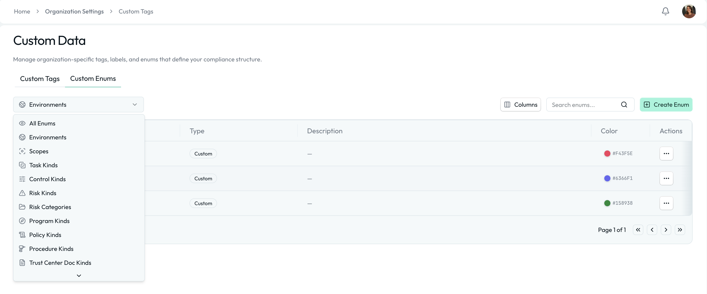
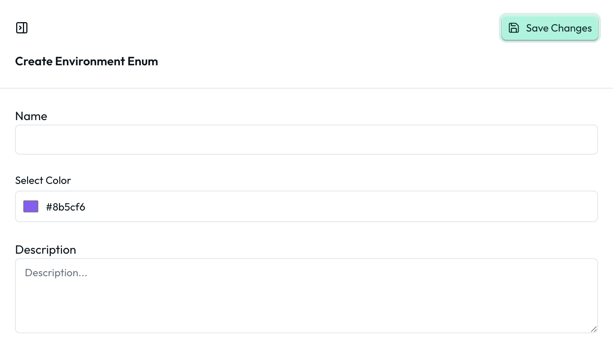

import Steps from '@site/src/components/Steps';

# Custom Data

Custom Data lets you shape how your compliance data is categorized without changing core workflows. Two complementary tools live under Organization Settings → Custom Data: **Custom Enums** create structure, and **Custom Tags** create flexibility.

## Custom Enums

Custom Enums let you define structured dropdown values that shape how compliance data is categorized across Openlane: object types such as environments, scopes, control kinds, risk categories, and more.

A Custom Enum is a predefined list of selectable values used throughout the platform to classify objects consistently. Unlike free-form fields, enums:

- Ensure standardized categorization
- Reduce inconsistent data entry
- Enable filtering and reporting
- Maintain audit-ready structure

Each enum value can include a name, an optional description, and a color.

### Global vs. Object-Specific Enums

Some enums are global and can be used across multiple object types (e.g., Environments), while others are specific to certain objects (e.g., Control Kinds for controls). When creating custom enums, be mindful of where they will be applied to ensure they fit the intended use case.

### System-Managed Enums

In addition to organization-created enums, some categories include System-Managed Enums. These are common, standardized values we provide to help you get started quickly and align with widely used terminology.

Key characteristics:

- Provided by Openlane
- Cannot be deleted
- Can be used like any other enum value
- Are not editable, but can be supplemented with custom values
- Designed to support common compliance patterns

System-managed enums ensure consistency across organizations while still allowing flexibility through additional custom values. For example:

- Default task kinds
- Standard risk categories
- Common document types for Trust Centers

You are free to use system-managed values, ignore them, or supplement them with your own organization-specific enums.

### How to Create a Custom Enum Value

<Steps>

1. Navigate to Organization Settings → Custom Data → Custom Enums
1. Select the enum category (e.g., Environments)
1. Click Create Enum, give the value a name (e.g., "Production"), and optionally a description and a color for dropdowns and reports
1. Click Save

</Steps>

You should see the new value in dropdowns across the platform immediately.

## Custom Tags

Tags let you apply flexible, lightweight labels to objects across Openlane. Located in Organization Settings → Custom Data → Custom Tags, tags help teams organize, filter, and segment compliance data without changing core structure or workflows.

A Custom Tag is a reusable label that can be applied to records such as controls, risks, tasks, policies, vendors, assets, and more. Tags are:

- Multi-select
- Optional
- Organization-defined
- Designed for filtering and segmentation

Unlike enums, tags are not tied to strict object structure. They exist to help teams categorize information in ways that reflect how they operate.

### Why Use Custom Tags?

Custom Tags are ideal when:

- You need temporary or evolving classifications
- You want to group related items across object types
- You need additional filtering in dashboards
- You want to flag items for internal workflows

Tags allow teams to adapt quickly without requiring governance changes.

### How to Create a Custom Tag

<Steps>

1. Navigate to Organization Settings → Custom Data → Custom Tags
2. Click Create Tag, name it, and optionally add a description and color. The field worth attention is **Aliases**: alternative names that resolve to the same tag, which keeps your taxonomy from fragmenting into near-duplicates ("hipaa", "HIPAA")
3. Click Save

</Steps>

You should see the tag available across supported objects immediately. Tags can also be created on the fly when editing records, allowing for quick categorization without leaving the workflow.

## Choosing Between Enums and Tags

| Custom Tags                         | Custom Enums                        |
| ----------------------------------- | ----------------------------------- |
| Flexible, multi-select labels       | Structured dropdown categories      |
| Used for lightweight classification | Used for core object structure      |
| Free-form and optional              | Controlled, standardized values     |
| Evolve easily over time             | Governed and standardized           |
| Great for filtering and grouping    | Critical for reporting + governance |
