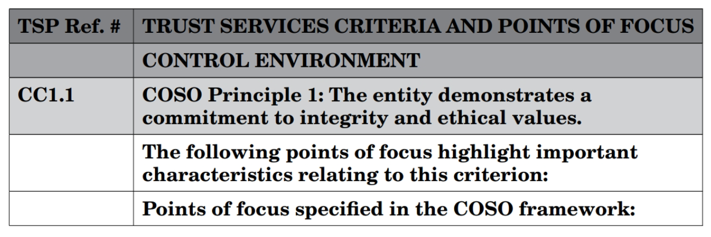
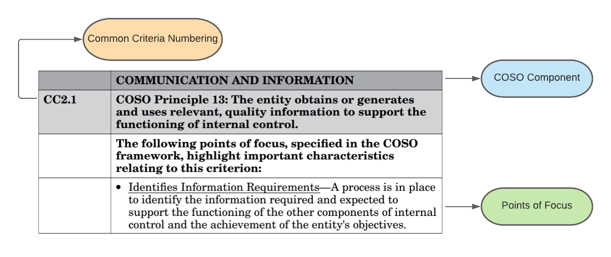
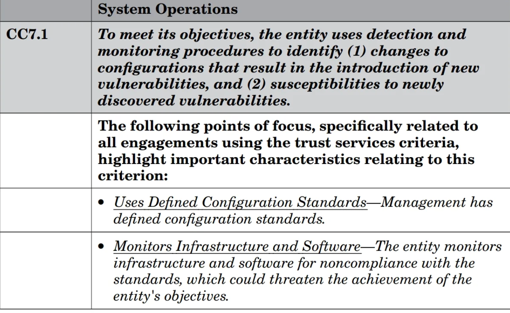

<head>
  <meta name="keywords" content="SOC 2, SOC 2 compliance, Trust Services Criteria, AICPA, service organization controls, data security, cloud compliance" />
  <meta name="twitter:card" content="summary_large_image" />
  <meta property="og:title" content="SOC 2 Overview - Trust Services Criteria & Compliance Guide | Openlane" />
  <meta property="og:description" content="Comprehensive guide to SOC 2 compliance including Trust Services Criteria, implementation, and audit requirements" />
  <meta property="og:type" content="article" />
  <link rel="canonical" href="https://docs.theopenlane.io/docs/platform/standards/soc2/overview" />
  
</head>
import Tabs from '@theme/Tabs';
import TabItem from '@theme/TabItem';

# SOC 2 (Service Organization Control 2)

SOC 2 stands for Service Organization Controls and is a comprehensive auditing framework developed by the American Institute of Certified Public Accountants (AICPA). It defines criteria for managing customer data based on five "Trust Service Principles" and is specifically designed for service organizations that store, process, or transmit customer data.

## Framework Information

| **Aspect** | **Details** |
|------------|-------------|
| **Full Name** | Service Organization Control 2 |
| **Governing Body** | American Institute of Certified Public Accountants (AICPA) |
| **Current Version** | 2017 Trust Services Criteria |
| **Framework Type** | Voluntary audit framework |
| **Primary Focus** | Data security and availability for service organizations |
| **Geographic Scope** | Primarily United States, accepted globally |
| **Target Users** | SaaS companies, cloud providers, managed service providers, any organization handling customer data |
| **Typical Implementation Time** | 6-18 months |
| **Average Annual Cost** | $15,000 - $50,000 (audit costs) + internal resources |
| **Certification Validity** | Typically 12 months (Type II reports) |
| **Official Website** | [AICPA SOC Reports](https://www.aicpa.org/interestareas/frc/assuranceadvisoryservices/aicpasoc2report.html) |

## Compliance Snapshot

| **Metric** | **Value** |
|------------|-----------|
| **Total Trust Service Criteria** | 5 (Security, Availability, Processing Integrity, Confidentiality, Privacy) |
| **Common Criteria Points** | 17 (minimum security requirements) |
| **Additional Criteria Points** | 46 (across the 4 optional criteria) |
| **Total Points of Focus** | 63 across all criteria |
| **Control Categories** | 8 (based on COSO framework components) |
| **Report Types** | 2 (Type I - design, Type II - operating effectiveness) |
| **Minimum Audit Period** | 3 months (Type II) |
| **Maximum Audit Period** | 12 months (Type II) |

## What is SOC 2?

SOC 2 is a framework that dictates how service organizations should process and handle customer information. It ensures the confidentiality, availability, and integrity of customer data. The framework is built on the Committee of Sponsoring Organizations (COSO) internal control framework and provides assurance that service organizations have appropriate controls in place.

### Key Characteristics

- **Risk-Based**: Controls are selected based on the organization's specific risks and business model
- **Flexible**: Organizations can choose which Trust Service Criteria apply to their business
- **Evidence-Based**: Requires documented evidence of control implementation and effectiveness
- **Third-Party Validated**: Independent auditors assess and report on control effectiveness

## AICPA COSO Framework

**What is the COSO Framework?**

The COSO Framework is a framework for designing, implementing, and monitoring internal controls to be incorporated into business processes. Additionally, the framework provides a level of assurance that the organization is ethically sound, transparent in its operating procedures, and aligned with industry best practices.

**What makes up the framework?**

The framework consists of five different components. Along with three internal objectives. The three internal objectives that the COSO framework aims to achieve are the following:

1. Operations Objectives
2. Reporting Objectives
3. Compliance Objectives

**The five components that help achieve the objectives above are the following**

1. Control Environment
2. Risk Assessment
3. Control Activities
4. Information & Communication
5. Monitoring Activities

It's important to note that the control environment is the scope of the environment where control activities are taking place. Oftentimes companies and auditors will limit the scope of the environment depending on the size of the organization and how the data is moved across the platform. This will then impact things such as risk assessments and control activities.

Risk assessments should be actively taking place in the organization. This will include a subset of controls such as evaluating vendor risk and software vendors. In today's fast-paced business world security assessments often come in the form of a security questionnaire. Which is then evaluated by the business from a security perspective. Alternatively, businesses are also requesting attestation reports such as a SOC 2, or ISO 27001 report before deciding between vendors. Monitoring activities come in the form of many different processes and procedures. However, with regards to SOC 2, there are two different types: Administrative and technical. As we continue through this course you will start to see and notate the difference between administrative and technical controls.

## Trust Services Criteria and Points of Focus

**What are Trust Service Criteria?**

The trust service criteria are the overall criteria that your organization will be audited on. The organization will have gone over the criteria beforehand with the auditor. Or if you're an auditor, you will go over the Trust Service Criteria with your client to ensure that a proper scope has been defined before the auditing period begins. The Trust Service Criteria are listed below.

<Tabs className="unique-tabs">
  <TabItem value="Security">**Security (Required)** - Ensuring that the information systems and data are protected against unauthorized access and disclosure. Also make sure that damage from malicious software doesn't impact your information systems to the extent that it would impact confidentiality, integrity, or availability. Also known as the CIA triad. This is the only mandatory criteria for all SOC 2 audits.</TabItem>
  <TabItem value="Availability">**Availability (Optional)** - Ensuring that your Information Systems are operational during normal operating hours, and their intended use is not impacted by your organizations' processes. This includes system uptime, disaster recovery, and business continuity planning.</TabItem>
  <TabItem value="Processing Integrity">**Processing Integrity (Optional)** - The system or solution that has been developed processes information correctly, in a timely manner, and encompasses proper authorization when doing so. Meaning proper access is defined and reports or data cannot be accessed by a user who doesn't have the appropriate access rights.</TabItem>
  <TabItem value="Confidentiality">**Confidentiality (Optional)** - Information that has been classified as confidential is secure within the documented scope of Information systems and is free from tampering or misuse. This goes beyond general security to protect specifically designated confidential information.</TabItem>
  <TabItem value="Privacy">**Privacy (Optional)** - Customer or personal information that is obtained, used, disclosed, or retained is properly obtained using legal methods; such as a DPA, Contract, Data sharing agreement. Also, the organization should have a policy and process in place for collection methods, and data deletion.</TabItem>
</Tabs>

When reviewing the trust services criteria it is important to note that not all of the trust service criteria have to be met in order to obtain a satisfactory SOC 2 report. However, the business has to meet the objectives that have been defined as part of the scope between the business and the auditing firm. Also at a minimum, the business will need to comply with the **Security** criteria (Common Criteria), which is mandatory for all SOC 2 audits.

### Points of Focus

Points of Focus are intended for you as a SOC implementer or consultant to help customers achieve controls that are suitable to their organization. You can think of points of focus like helpful hints, tips, and tricks in regards to what the control is trying to prevent, mitigate or detect. Additionally, organizations that are trying to achieve a SOC 2 attestation do not have to comply with all of the Points of Focus. It's important to understand that these are not requirements but rather guidance.

**Example**

Let's review several examples of point-of-focus statements.

When reviewing the above figure you can see how the trust service criteria, component of COSO (control environment), common criteria, and point of focus are laid out.

**Point of Focus Example**

There are two points of focus mentioned above. They are the following:

1. Uses Defined Configuration Standards
2. Monitors Infrastructure and Software

Breaking down the points of focus: Using the scope that was defined early on in the audit engagement, you as a SOC 2 Lead Implementer should know what information systems and processes are in scope. The first point of focus talks about configuration management. This is talking about the configuration standards for the information systems that are in scope. The second point of focus is referring to infrastructure and monitoring of software. The organization should be monitoring for system outages or more specifically when the CIA triad is violated. The second part of this point of focus is the organization should be monitoring what type of software is deployed in the environment.

## Target Users and Applications

### Primary Target Organizations
- **SaaS Companies**: Software-as-a-Service providers handling customer data
- **Cloud Service Providers**: Organizations offering cloud infrastructure or platform services
- **Managed Service Providers**: Companies providing IT services to other organizations
- **Data Centers**: Facilities hosting customer systems and data
- **Healthcare Technology Companies**: Organizations handling protected health information
- **Financial Services**: Companies processing financial data for customers
- **E-commerce Platforms**: Organizations handling customer transactions and personal data

### Business Drivers for SOC 2
- **Customer Requirements**: Enterprise customers often require SOC 2 reports before signing contracts
- **Competitive Advantage**: Differentiation in the marketplace through demonstrated security controls
- **Risk Management**: Systematic approach to identifying and managing security risks
- **Regulatory Readiness**: Foundation for meeting various regulatory requirements
- **Insurance Benefits**: Potential reductions in cybersecurity insurance premiums

## Implementation Timeline and Costs

### Typical Implementation Phases

| **Phase** | **Duration** | **Activities** | **Key Deliverables** |
|-----------|--------------|----------------|---------------------|
| **Gap Analysis** | 2-4 weeks | Current state assessment, control mapping | Gap assessment report, remediation roadmap |
| **Control Design** | 4-8 weeks | Policy development, procedure creation, system configuration | Policies, procedures, control documentation |
| **Implementation** | 8-16 weeks | Control deployment, staff training, system hardening | Implemented controls, trained personnel |
| **Pre-Audit Testing** | 4-6 weeks | Internal testing, evidence collection, remediation | Test results, evidence portfolio |
| **Audit Period** | 3-12 months | Operating controls, evidence generation | Control evidence, audit-ready documentation |
| **Audit Execution** | 4-8 weeks | Auditor testing, interviews, final review | SOC 2 report |

### Cost Breakdown

| **Cost Category** | **Range** | **Notes** |
|-------------------|-----------|-----------|
| **External Audit Fees** | $15,000 - $50,000 | Varies by organization size, complexity, and audit firm |
| **Implementation Consulting** | $20,000 - $100,000 | Optional, depends on internal capabilities |
| **Internal Resources** | $50,000 - $200,000 | FTE costs for implementation and maintenance |
| **Technology/Tools** | $5,000 - $25,000 | GRC platforms, monitoring tools, security solutions |
| **Training and Certification** | $2,000 - $10,000 | Staff training and professional certifications |
| **Annual Maintenance** | $30,000 - $100,000 | Ongoing audit, monitoring, and compliance activities |

## Benefits of SOC 2 Compliance

### Business Benefits
- **Market Access**: Qualification for enterprise sales opportunities
- **Customer Trust**: Demonstrated commitment to data security and privacy
- **Competitive Differentiation**: Advantage over non-compliant competitors
- **Sales Acceleration**: Streamlined due diligence processes
- **Partnership Opportunities**: Access to partner ecosystems requiring compliance

### Operational Benefits
- **Risk Reduction**: Systematic identification and mitigation of security risks
- **Process Improvement**: Standardized policies and procedures
- **Incident Response**: Formal incident management capabilities
- **Vendor Management**: Structured approach to third-party risk assessment
- **Employee Awareness**: Enhanced security culture and training

### Financial Benefits
- **Premium Pricing**: Ability to charge premium prices for secure services
- **Reduced Insurance Costs**: Potential cybersecurity insurance discounts
- **Avoided Breach Costs**: Prevention of costly data breaches and incidents
- **Investor Confidence**: Demonstrated operational maturity for funding rounds

## Common Implementation Challenges

### Technical Challenges
- **Legacy Systems**: Integrating security controls with older systems
- **Cloud Complexity**: Managing controls across multiple cloud environments
- **Data Classification**: Identifying and protecting sensitive data across systems
- **Access Management**: Implementing least-privilege access controls
- **Monitoring and Logging**: Comprehensive security monitoring across all systems

### Organizational Challenges
- **Resource Constraints**: Limited budget and staff for implementation
- **Change Management**: Adapting to new policies and procedures
- **Cross-Functional Coordination**: Aligning IT, security, legal, and business teams
- **Documentation Overhead**: Maintaining comprehensive documentation
- **Continuous Compliance**: Sustaining controls over time

## Related Documentation

- [SOC 2 Audit Principles](./auditprinciples.mdx)
- [SOC 2 Audit Procedures](./auditprocedures.mdx)
- [Conducting a SOC 2 Audit](./conducting-a-soc-2-audit.mdx)
- [Planning and Preparation](./planningandprep.mdx)
- [Required Documentation](./requireddocumentation.mdx)
- [Framework Subject Matter](./framework-subject-matter.mdx)
- [Security Management Procedures](./security-management-procedures.mdx)
- [SOC 2 FAQ](./faq.mdx)
- [Bridge Letter](./bridge-letter.mdx)

## Additional Resources

- [AICPA Trust Services Criteria](https://www.aicpa.org/interestareas/frc/assuranceadvisoryservices/aicpasoc2report.html)
- [SOC 2 Implementation Guide](https://www.aicpa.org/content/dam/aicpa/interestareas/frc/assuranceadvisoryservices/downloadabledocuments/trust-services-criteria.pdf)
- [COSO Internal Control Framework](https://www.coso.org/Pages/ic.aspx)
- [Trust Services Criteria Points of Focus](https://www.aicpa.org/content/dam/aicpa/interestareas/frc/assuranceadvisoryservices/downloadabledocuments/trust-services-criteria.pdf)