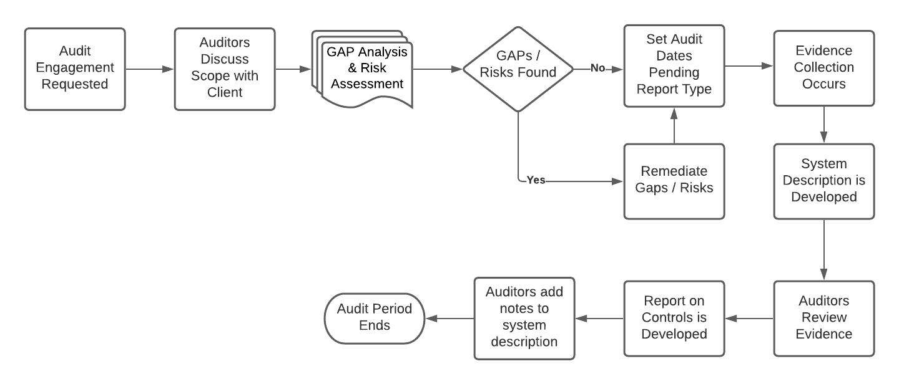

# Planning and Preparation

The below diagram does not depict all processes in an audit however it provides you with a high-level overview of what high level steps are involved in going through a SOC2 audit. Every auditing firm, consultant, and lead implementer will have its own processes and techniques for completing the audit.

## Audit Timeline and Period

Different types of SOC audits have different audit timelines and audit periods. For example, take into account that a SOC 2 Type 1 Report has a minimum auditing period of 3 months. A SOC 2 Type 2 report has a minimum audit period of 6 months. An organization can consider first obtaining a SOC 2 Type 1 report as a metric to see where the organization stands when it comes to its people, processes, and technology. After the SOC 2 Type 1 report has been completed, the organization will then move on to a SOC 2 Type 2 report. The SOC 2 Type 2 report will encompass the same controls as the SOC 2 Type 1 report. However, the SOC 2 Type 2 report will have a longer audit period and will require more evidence to be collected.

Timelines will vary greatly between organizations. However several key metrics are used to determine how much work needs to be completed for an organization before an audit period begins. One of these key metrics is known as a gap analysis. Another key metric would be a risk assessment. The risk assessment should be able to also identify gaps of where controls could be missing or processes that are deficient.

## Defining The Audit Scope

Prior to the engagement with an auditing firm or service auditor. The management at the service organization should have properly defined the system scope. However, with smaller organizations, that is not always the case. These would be the high level steps that you could take to define the system scope.

1. Identification of services provided to customers
1. Identification of system(s) used to provide services
1. Identification of business partners or consultants that provide copyrights, patents or Intellectual property or services to the system(s)
1. Defining and selecting the Trust Services Categories to be included in the scope of attestation.
1. Defining if the organization should undergo a Type I or Type II SOC 2 audit.
1. Defining the "As of Date" as notated for a SOC 2 Type 1 Report
1. Determining if sub-service organizations/sub-level services are a part of the overall system and if they need to be included in the attestation report.
1. Identifying and analyzing risks that hinder a service organization from its service commitments of defined SLA's.
1. Obtaining system-level requirements as they relate to business partners.

Once you have a solid understanding of the system scope and the pieces of the puzzle, it's best to get confirmation from the organization's management team that all sub-level service organizations have been identified and are listed as in scope for the audit. It is also important to verify with management on whether these sub services would be included in the attestation report or will a carve-out method be used. Should it be the latter, then it should be clearly specified in section 1 of the report that all controls relating to the sub-service organization will be excluded.

The next steps in the audit scoping process would be to sit down and map out what controls types if any sub-level organizations would fall under. An example of this would be controls for availability. Most of the time when evaluating cloud services controls that deal with availability will fall under the cloud hosting providers, such as Amazon AWS, Google Cloud, and Microsoft Azure. However, it will be the organizations' responsibility to ensure that these configurations and processes are put into place.

## Key Stakeholder Identification

After the organization has selected an auditing firm for the engagement. It's important that as a lead implementer or consultant, you define "who" from the organization will be in charge to assist with the following responsibilities. This should include multiple people from different departments within the organization.

**Responsibilities of Organization**

| Control Design        | Policy Owners                           | Creation of System Description |
| --------------------- | --------------------------------------- | ------------------------------ |
| Define Control Owners | Managed Services                        | Process & Procedures Owners    |
| Evidence Collection   | Identification of Sub Service Providers | Management Response Team       |

Stakeholder Identification is important because it will allow you the opportunity to not only meet the team you will be working with for the foreseeable future, but it also helps you establish a relationship with team members as SOC 2 has a rolling audit period.

Please note that the table above does not encompass everything needed for stakeholder identification. Every organization and platform is different, be sure to take the time to understand the organization, technology, and most importantly the people that make the magic happen.

## Gap Analysis

The gap analysis is a forward-looking review of the organization's controls and processes, that seeks to identify where there are shortcomings or subpar implementations that could result in security flaws, regulatory non-compliance or simply non-adherence to business and control environment best practices.

The gap analysis process is a forward-looking exercise. The current implementation of the process is examined, identifying any areas of concerns, and then a corrective action plan is drafted up, reviewed, agreed upon, and approved in order to provide guidance for how to remediate the identified gaps.

It is important to note that when performing a gap analysis for SOC 2, the organization should set out to identify any gaps based on the relevant TSC for the scoping criteria relevant to the audit in particular. In order to successfully achieve this, the lead implementer should identify all controls and processes relevant to the organization (based on the TSC scope relevant to the audit) and then perform a line-by-line review of this to identify any relevant gaps.Successfully performing the gap analysis process will set up the organization for SOC 2 success.

### Identifying Gaps and Remediation

As mentioned, the gap analysis is a forward-looking, ongoing process. It should identify all relevant controls to the organization for the audit, evaluate the current operational processes and controls, identify where deficiencies exist, and provide clear, realistic guidance for resolving all focus areas.

The lead implementer should include all relevant parties for the gap analysis process in order to have an accurate understanding of the organizational controls and processes. The process should include inquiry, walkthroughs, etc, in order to have a precise understanding of the necessary controls and processes. It is also important that all relevant parties are involved in order to establish accountability for the implementation in order to resolve these gaps.

Gap remediation should be prioritized according to the impact of the gap on the organization and its security in particular, as well as based on the benefit to the organization (by resolving this deficiency).Time lines need to be established in order to maintain appropriate resolution of gaps as well as to provide feedback to any stakeholders regarding the improvement and forward-looking plans for the organization.

### Technical, Procedural, and Administrative Controls Implementation

Earlier in this course we discussed 3 different types of internal auditing controls. They were detective, preventative, and corrective controls. Now we're going to discuss technical, procedural, and administrative controls.

**Technical Control** - A control type that is covered under a technical system or device.

_Examples_ - Anti-malware, System Incident Event Management System

**Procedural Control** - A process in which employees or software performs an action to achieve the desired result.

_Examples_ - User access review, Annual policy updates, Endpoint compliance reviews

**Administrative Control** - A guideline that a business or business unit publishes in order to comply with compliance objectives, or the law.

_Examples_ - New company policy, Code of conduct

Each company will have different controls depending on company size, and technology used. However, the over-archiving objectives for the controls are the same regardless of what technology is being used. You will find that companies will sometimes use a process to comply with technical controls. Whereas another company may have the control covered end to end with automation.

**Control deficiencies and Implementation**

Now that we have talked about the following control types, and what they entail. Your job as a consultant or lead implementer will be to assess after the gap analysis if any new controls need to be designed to ensure the organization is meeting its compliance requirements. This should be completed after the gap analysis.

### Prioritization

**Keeping the organization on track**

While there are many steps when preparing an organization for a SOC 2 attestation. There is nothing more rewarding than keeping them on track. Listed below is a prioritization list, this list should be adapted to your project plan and the organizations' needs.

**Prioritization list**

1. Selecting an Auditor
1. Identification of Key Stakeholders
1. Performing a Gap Analysis
1. Selecting and Designing Controls
1. Control Implementation
1. Control Monitoring
1. Submission of Evidence

Your job will be to prioritize both the auditors' needs and the organizations' needs while maintaining an open line of communication to both parties. The list above is in chronological order as to what should be completed from a project planning perspective.

**Prioritization of Controls**

After you have identified gaps with the organization, you will need to sit down and have a detailed conversation with the organization. This will include discussing potential budgetary adjustments to ensure the organization is committed to achieving a satisfactory SOC 2 attestation.

You will need to layout and define the missing controls that need to be in place to achieve the desired Trust Services Criteria that was selected by the organization. At a minimum, they must comply with the common criteria. Where only one control is identified to address a common criteria, it might be worthwhile to design and implement another control. This will help prevent a common criteria from failing, by having a “back up” control in place.
