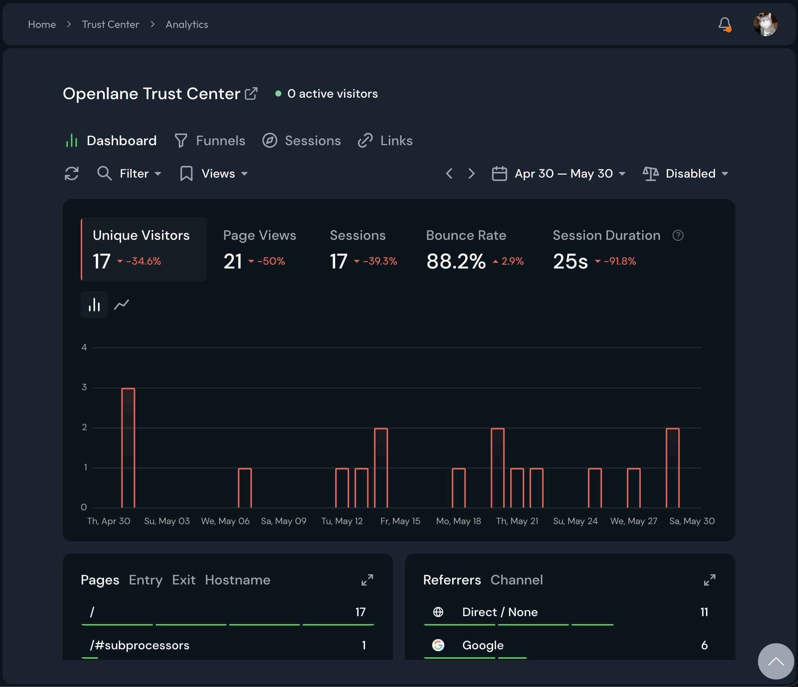

import Term from '@site/src/components/Term';

# Analytics

We built an analytics dashboard into the Trust Center so you can see how prospects and customers engage with your public page: how many people visit, what they look at, and where they come from. Analytics are powered by [Pirsch](https://pirsch.io), a privacy-friendly, cookieless analytics provider.

## What You Can See

The dashboard summarizes visitor engagement over a date range you choose: visitor counts, sessions, and page views, plus two metrics worth interpreting. Bounce rate is the share of sessions that left after viewing a single page, a signal that visitors did not find what they came for. Session duration averages the time spent per visit, which rises when prospects are reading your content rather than skimming past it.

Below the summary you can see which **Pages** get the most attention (for example, your main page versus the <Term t="subprocessor">subprocessors</Term> section) and which **Referrers** send visitors your way (direct links, search engines, and other channels).

## Best Practices

- Check analytics after sharing your Trust Center link in a sales cycle to confirm prospects are engaging
- Watch which sections draw attention; heavy traffic to subprocessors or documents tells you what your audience cares about
- Compare periods after publishing [updates](./updates.mdx) or new content to see whether announcements drive visits
