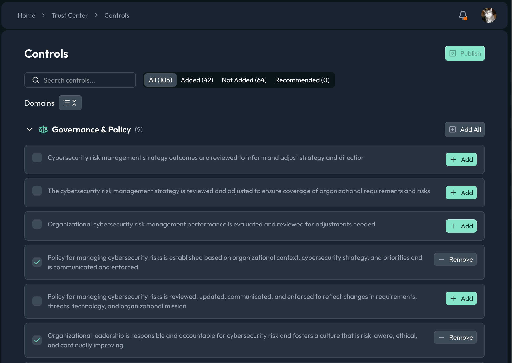

# Controls

Alongside [documents](./documents.mdx) and [frameworks](./frameworks.mdx), your Trust Center can publish individual security controls, concise statements of what you do to manage risk. This gives visitors a more granular view of your program than certifications alone, without exposing the internal detail of your control set.

Controls on the Trust Center are drawn from a dedicated Openlane Trust Center control set. You choose which of these controls to add to your Trust Center, and only the ones you publish are ever shown to visitors.

## How It Works

The Controls page lists the available Trust Center controls grouped by domain (for example, **Governance & Policy**). For each control you can:

- **Add** a control to your Trust Center
- **Remove** a control you previously added
- **Add All** controls within a domain at once

The tabs at the top let you focus your work:

| Tab | Shows |
| --- | --- |
| **All** | Every available Trust Center control |
| **Added** | Controls you have added to your Trust Center |
| **Not Added** | Controls you have not yet added |
| **Recommended** | Controls suggested for your Trust Center |

Use the search box to find a control by its text, and the domain groupings to work through related controls together.

## Visibility

A control is only shown to visitors when it is both added to your Trust Center and marked publicly visible. Controls default to **not visible**, so adding a control does not expose it until you publish. This lets you stage your control selection privately and reveal it when you are ready.

| State | Result |
| --- | --- |
| Not added | Never shown on the Trust Center |
| Added, not visible | Selected internally, not shown to visitors |
| Added, publicly visible | Shown to visitors on your Trust Center |

## Publishing

Like the rest of the Trust Center, control changes follow the draft/publish workflow. Add and remove controls, review the result on your preview URL, and click **Publish** when you are ready for visitors to see the updated set. Nothing you change is public until you publish.

## Best Practices

- Start from the **Recommended** tab to get a sensible baseline, then refine
- Only publish controls you actually operate; inaccurate claims undercut the trust the page is meant to build
- Group your selections by domain so visitors see coherent coverage rather than a scattered list
- Preview before publishing to confirm the visitor-facing set reads the way you intend
