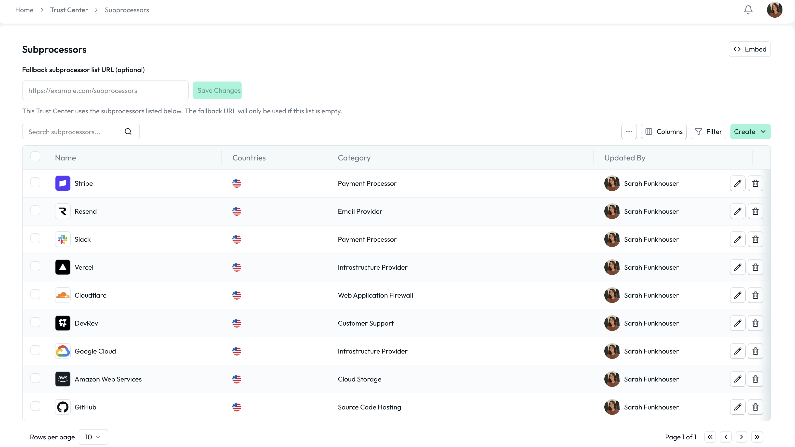
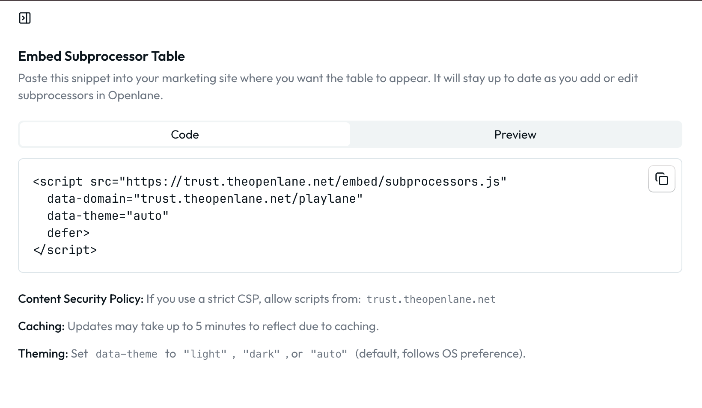

# Subprocessors

List the third-party services that process customer data on your behalf. This transparency helps customers understand your supply chain and meets regulatory requirements like GDPR.

## What Counts as a Subprocessor

A subprocessor is any third-party that processes personal data for you:

- Cloud infrastructure (AWS, GCP, Azure)
- Payment processors (Stripe, PayPal)
- Email services (SendGrid, Mailchimp)
- Customer support platforms (Zendesk, Intercom)
- Analytics services
- Authentication providers

## Why Disclose Them

- **Regulatory compliance**: GDPR and other regulations require disclosure
- **Customer trust**: Transparency about your supply chain builds confidence
- **Customer compliance**: Helps customers with their own vendor assessments

## Adding Subprocessors

From the [subprocessor management page](https://console.theopenlane.io/trust-center/subprocessors), you can manage your list of subprocessors.



You can add subprocessors from our existing vendor list or create new ones. For each subprocessor, include:

- Name and description of what they do
- Countries where data is processed
- Category to help visitors understand their role

### Categories

Categorize subprocessors so visitors can quickly understand what each vendor does:

- **Infrastructure**: Cloud providers, hosting services
- **Analytics**: Analytics and monitoring tools
- **Communications**: Email, messaging, notification services
- **Payments**: Payment processing services
- **Security**: Security tools and services
- **Support**: Customer support platforms
- **Storage**: Data storage and backup services

:::note
 Need a category that doesn't exist? You can create custom categories to fit your specific vendor landscape using the [custom enums](https://console.theopenlane.io/organization-settings/custom-data?tab=enums) feature. Trust center subprcessor categories are based on the `Trust Center Subprocessor Kind` enum. Adding a new value to this enum will allow you to use that category when adding subprocessors. To read more about custom enums and how to use them, check out our documentation [here](https://docs.theopenlane.io/platform/basics/custom-data/custom-enums).
:::

## Keeping the List Current

Update your subprocessor list when you add or remove vendors that process customer data. Consider building this into your vendor onboarding process.

## Best Practices

- Include all vendors that process customer data, even indirectly
- Provide clear descriptions of what each vendor does
- Accurately list the countries where data is processed
- Review the list periodically for accuracy

## Embedding Subprocessor Information

In order to better manage your subprocessors in one location, you can embed the subprocessor information directly into your privacy policy or other relevant documentation. This allows customers to easily access the information without navigating away from your site.

From the [subprocessor management page](https://console.theopenlane.io/trust-center/subprocessors), you can generate an embed code that can be placed in your privacy policy. This ensures that the information is always up-to-date and easily accessible to your customers.



Example:

```html
<script src="https://trust.theopenlane.net/embed/subprocessors.js"
  data-domain="trust.theopenlane.net/<org-slug>"
  data-theme="auto"
  defer>
</script>
```

When implementing the embed code, keep the following in mind:

1. If you use a strict CSP, allow scripts from: `trust.theopenlane.net`
1. Updates may take up to 5 minutes to reflect due to caching
1. Set data-theme to "light", "dark", or "auto" (default, follows OS preference).

Subprocessors information will be automatically updated as your make changes, ensuring that your customers always have access to the most current information about your data processing practices.


