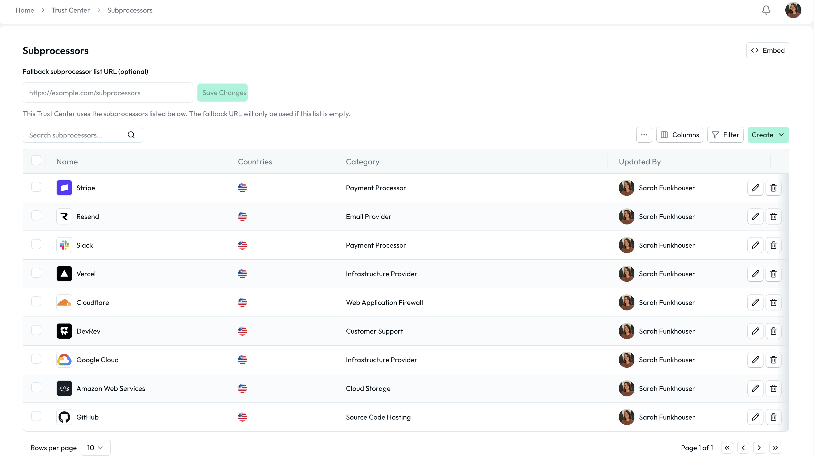
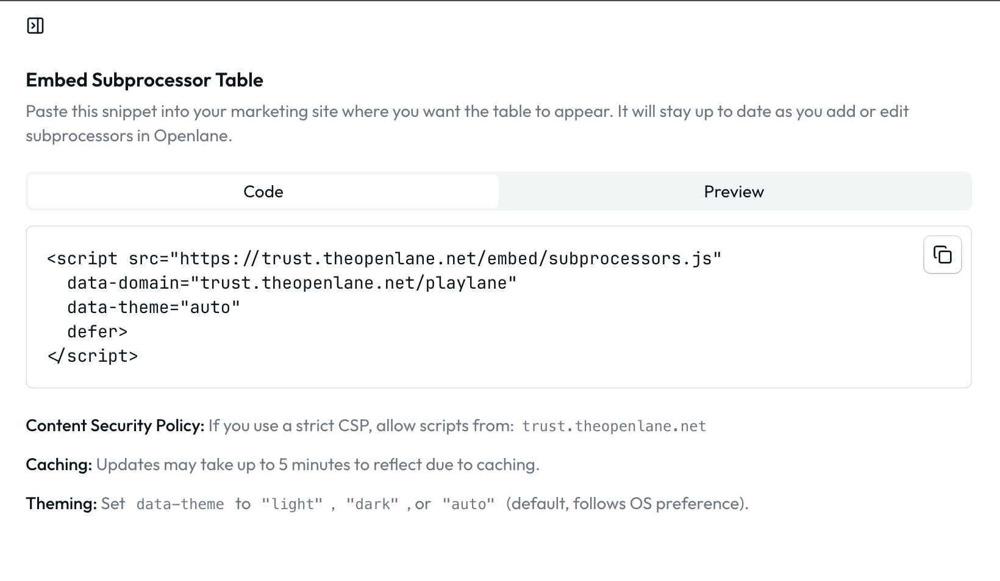

import Term from '@site/src/components/Term';

# Subprocessors

List the third-party services that process customer data on your behalf. This transparency helps customers understand your supply chain and meets regulatory requirements like General Data Protection Regulation (GDPR).

## What Counts as a Subprocessor

The term comes from the data-protection chain of responsibility: your customer is the **controller** of their personal data, you are the **processor** handling it on their behalf, and any vendor you engage that touches that data in turn is a <Term t="subprocessor">subprocessor</Term>. Your customers answer to their regulators and their own customers for the whole chain, which is why they expect to see it.

A subprocessor is any third party that processes, stores, or transmits customer data on your behalf:

- Cloud infrastructure (AWS, GCP, Azure)
- Payment processors (Stripe, PayPal)
- Email services (SendGrid, Mailchimp)
- Customer support platforms (Zendesk, Intercom)
- Analytics services
- Authentication providers

Not every vendor qualifies. The test is data involvement, not importance: your CDN and your CRM likely process customer data; your office supplier and facilities vendor do not, however critical they are to operations. When in doubt, trace whether customer data can reach the vendor's systems.

## Why Disclose Them

Disclosure is a legal requirement before it is a courtesy. GDPR Article 28 requires that customers be informed about the subprocessors handling their personal data, and California Consumer Privacy Act (CCPA) expects documented data flows and third-party management. Auditors also ask for documented, monitored handling of data by third parties, and the published list is the visible proof of that practice.

The list also does work for your customers: they need it to complete their own vendor assessments and disclosures, because your subprocessors are part of their supply chain too.

## Managing Subprocessors

The public list is the visible end of a vendor management practice, and auditors look for the practice behind it:

<div className="row cards-row">
<div className="col col--6">
<div className="card">
<div className="card__header"><h4>Data processing agreements</h4></div>
<div className="card__body">

Every subprocessor should be under a data processing agreement (DPA) covering data handling, breach notification, and regulatory compliance; GDPR Article 28(3) makes this mandatory when personal data is in scope. You likely owe the mirror-image DPA to your own customers.

</div>
</div>
</div>
<div className="col col--6">
<div className="card">
<div className="card__header"><h4>Due diligence before engagement</h4></div>
<div className="card__body">

Review a prospective subprocessor's security posture before customer data flows: their System and Organization Controls 2 (SOC 2) report or ISO 27001 certificate, and their incident response commitments. The [vendor records](../registry/entities.mdx) in your registry are where those reviews live.

</div>
</div>
</div>
<div className="col col--6">
<div className="card">
<div className="card__header"><h4>Ongoing monitoring</h4></div>
<div className="card__body">

Vendor reviews on a schedule, not just at onboarding; a subprocessor's posture can change between renewals.

</div>
</div>
</div>
<div className="col col--6">
<div className="card">
<div className="card__header"><h4>Breach notification flow-through</h4></div>
<div className="card__body">

Your DPAs need the vendor's notification obligations to be at least as fast as the ones you've promised downstream, because your customers expect prompt notice when something happens at a subprocessor.

</div>
</div>
</div>
</div>

Because the Trust Center list is built from the same vendor records you manage in the [registry](../registry/entities.mdx), keeping the vendor relationship current keeps the disclosure current, and [Trust Center notifications](./notifications.mdx) tell your subscribers automatically when the list changes, which covers the advance-notice expectation most customer DPAs carry.

## Adding Subprocessors

From the [subprocessor management page](https://console.theopenlane.io/trust-center/subprocessors), you can manage your list of subprocessors.



You can add subprocessors from our existing vendor list or create new ones. For each subprocessor, include:

- Name and description of what they do
- Countries where data is processed
- Category to help visitors understand their role

### Categories

Each subprocessor carries a category so visitors can tell at a glance what role a vendor plays without reading every description, which matters when a customer is scanning your list to complete their own vendor assessment.

:::note
If you need a category that doesn't exist, you can create custom categories to fit the vendors you actually use with the [custom enums](https://console.theopenlane.io/settings/custom-data?tab=enums) feature. Trust center subprocessor categories are based on the `Trust Center Subprocessor Kind` enum. Adding a new value to this enum will allow you to use that category when adding subprocessors. To read more about custom enums and how to use them, see [Custom Data](../settings/custom-data.mdx).
:::

## Keeping the List Current

Update your subprocessor list when you add or remove vendors that process customer data. We recommend building this into your vendor onboarding process so disclosure keeps pace with new vendors.

## Best Practices

- Include all vendors that process customer data, even indirectly
- Provide clear descriptions of what each vendor does
- Accurately list the countries where data is processed
- Review the list periodically for accuracy

## Embedding Subprocessor Information

To manage your subprocessors in one location, you can embed the subprocessor information directly into your privacy policy or other relevant documentation. This allows customers to easily access the information without navigating away from your site.

From the [subprocessor management page](https://console.theopenlane.io/trust-center/subprocessors), you can generate an embed code that can be placed in your privacy policy. This ensures that the information is always up-to-date and easily accessible to your customers.



Example:

```html
<script src="https://trust.theopenlane.net/embed/subprocessors.js"
  data-domain="trust.theopenlane.net/<org-slug>"
  data-theme="auto"
  defer>
</script>
```

When implementing the embed code, keep the following in mind:

- Set `data-theme` to "light", "dark", or "auto" (default, follows OS preference)

:::info
- If you use a strict Content Security Policy (CSP), allow scripts from: `trust.theopenlane.net`
- Updates may take up to 5 minutes to reflect due to caching
:::

Subprocessor information updates automatically as you make changes, so your customers always have access to the most current information about your data processing practices.


